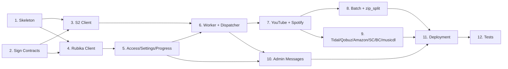

# Track A — Step-by-Step Implementation Plan

> Companion to [`task-split.md`](task-split.md). This file expands **Track A — "Kharej Worker + Storage + Control Bus"** into a sequential, actionable roadmap.
>
> Other relevant docs: [`architecture.md`](architecture.md) · [`message-schema.md`](message-schema.md) · [`current-features.md`](current-features.md) · [`migration-plan.md`](migration-plan.md)

**Owner**: Backend / Infrastructure developer (you)
**VPS**: Kharej VPS
**Stack**: Python 3.11+, `boto3` (Arvan S2), existing `rubetunes/` package, existing `rubpy`/Rubika client, `pytest-asyncio`.
**Total estimated effort**: ~20 developer-days.

---

## Overview of the 10 Steps

| # | Step | Phase | Effort | Depends on |
|---|------|-------|--------|------------|
| 1 | Project skeleton & `kharej/` package layout | Foundation | 0.5 d | — |
| 2 | Sign off shared contracts with Track B | Foundation | 0.5 d | — |
| 3 | Arvan S2 client (`s2_client.py`) | Foundation | 1.5 d | 1, 2 |
| 4 | Rubika control client (`rubika_client.py`) | Foundation | 2 d | 1, 2 |
| 5 | Access control + settings + progress reporter | Foundation | 1.5 d | 4 |
| 6 | Worker loop + dispatcher (job.create routing) | Foundation | 1 d | 3, 4, 5 |
| 7 | Downloader integration — YouTube & Spotify single | Downloaders | 3 d | 6 |
| 8 | Downloader integration — batch / playlist + zip_split | Downloaders | 3 d | 7 |
| 9 | Downloader integration — Tidal, Qobuz, Amazon, SoundCloud, Bandcamp, musicdl | Downloaders | 2 d | 7 |
| 10 | Admin control messages + cookies sync | Admin | 1.5 d | 5, 6 |
| 11 | Deployment (Dockerfile, docker-compose, .env) | Deployment | 1 d | all |
| 12 | Tests (unit + integration) | Testing | 3 d | all |

> Steps 1–6 are the **critical path** — nothing else compiles until they're done. Steps 7, 8, 9 can be parallelized by the same dev across days. Step 10 can start after Step 5. Steps 11 and 12 finalize the track.

---

## Step 1 — Project Skeleton & Package Layout

**Goal**: Create the `kharej/` Python package with the agreed structure so every later step has a place to land.

**Substeps**
1. Create directory tree:
   ```
   kharej/
     __init__.py
     worker.py
     rubika_client.py
     s2_client.py
     dispatcher.py
     access_control.py
     progress_reporter.py
     settings.py
     downloaders/
       __init__.py
       youtube.py
       spotify.py
       tidal.py
       qobuz.py
       amazon.py
       soundcloud.py
       bandcamp.py
       musicdl.py
       batch.py
     state/                 # gitignored, runtime state
     logs/                  # gitignored
     tests/
   ```
2. Add `kharej/__main__.py` so `python -m kharej.worker` is the entrypoint.
3. Add a `kharej/requirements.txt` pinning `boto3`, `rubpy` (or whichever Rubika lib is used), `pydantic`, `tenacity`, `prometheus-client`, `pytest`, `pytest-asyncio`.
4. Add a top-level `kharej/README.md` with a one-paragraph description and a link back to `docs/research/arvan-webui-migration/`.

**Deliverable**: Committed empty package that imports cleanly (`python -c "import kharej"` returns 0).

**Acceptance**: `python -m kharej.worker --help` prints a usage stub.

---

## Step 2 — Sign Off Shared Contracts (joint with Track B)

**Goal**: Freeze the coupling surface before any real code is written. **No further step in Track A starts until this is done.**

✅ **Done** — contracts frozen at `v=1` and codified in [`kharej/contracts.py`](../../../kharej/contracts.py). See [`CONTRACTS.md`](CONTRACTS.md).

**Substeps**
1. Read [`task-split.md` §3 Shared Contracts](task-split.md) and [`message-schema.md`](message-schema.md) end-to-end.
2. Joint review meeting with Track B; confirm:
   - Rubika message envelope (`RTUNES::` prefix, `v=1`, `type`, `job_id`, `ts`).
   - S2 key convention (`media/{job_id}/{safe_filename}` etc.).
   - Job lifecycle states (`pending → accepted → running → completed | failed | cancelled`).
   - `job.create` payload shape.
   - Env-var ownership table.
3. Open a PR that bumps `message-schema.md` to `v: 1` final (or whatever revision both agree on). Both devs approve.

**Deliverable**: Approved & merged PR pinning the contracts.

**Acceptance**: Track B and Track A both reference the same `message-schema.md` commit SHA in their work tickets.

---

## Step 3 — Arvan S2 Client (`s2_client.py`)

**Goal**: A small, well-tested wrapper over `boto3` for the Kharej side that knows nothing about Rubika or jobs — just S2 I/O.

**Substeps**
1. Implement `S2Client` class with config from env (`ARVAN_S2_ENDPOINT`, `ARVAN_S2_ACCESS_KEY_WRITE`, `ARVAN_S2_SECRET_WRITE`, `ARVAN_S2_BUCKET`, region).
2. Methods:
   - `upload_file(local_path: Path, key: str, *, content_type: str | None = None, on_progress: Callable[[int, int], None] | None = None) -> S2Object`
   - `upload_stream(stream, key, *, length, content_type=None, on_progress=None) -> S2Object` — uses multipart for >100 MB.
   - `delete_object(key: str) -> None`
   - `delete_prefix(prefix: str) -> int` (for cleanup of failed jobs).
   - `head_object(key: str) -> S2Object | None`
   - `generate_presigned_upload_url(key: str, expires: int = 3600) -> str` (only used if Track B ever needs to push cookies back).
3. Build `S2Object` dataclass: `key`, `size`, `etag`, `sha256`, `content_type`.
4. Compute SHA-256 while streaming the upload (single pass, no double-read).
5. Use `tenacity` for retries with exponential backoff on `EndpointConnectionError`, `5xx`, throttling.
6. Structured logging (JSON lines) for every upload: `key`, `size`, `duration_ms`, `attempts`.

**Deliverable**: `kharej/s2_client.py` + `kharej/tests/test_s2_client.py` (mocked with `moto` or `botocore.stub.Stubber`).

**Acceptance**:
- 100% of public methods have unit tests.
- Manual smoke test against a real Arvan bucket: upload a 10 MB and a 200 MB file, verify both via `aws s3 ls --endpoint-url=...`.

> ✅ **Done in PR #36** — `kharej/s2_client.py` implemented with `S2Config` (Pydantic v2, `from_env()`), `S2Client` (path-style s3v4, single-pass SHA-256, multipart with abort-on-failure, tenacity retries, structured logging), full exception hierarchy (`S2Error`, `S2NotFound`, `S2AccessDenied`, `S2UploadFailed`), and `_should_retry` policy. `kharej/tests/test_s2_client.py` covers all 18 required test cases (moto + Stubber) at **90% line coverage** (≥85% requirement met).

---

## Step 4 — Rubika Control Client (`rubika_client.py`)

**Goal**: Subscribe to messages from the Iran-side Rubika account, parse `RTUNES::` envelopes, and hand them off to the dispatcher. Also publish outbound messages.

**Substeps**
1. Wrap the chosen Rubika library (`rubpy` or current one in `rub.py`) behind a small interface so it can be swapped:
   ```python
   class RubikaClient:
       async def start(self) -> None
       async def send(self, peer_guid: str, payload: dict) -> None
       def on_message(self, handler: Callable[[Message], Awaitable[None]]) -> None
   ```
2. Implement parser:
   - Reject any text not starting with `RTUNES::`.
   - JSON-decode the rest, validate against a Pydantic model per `type`.
   - Reject if `v != 1` (log a warning; Track B will respect the contract).
   - Reject messages from any GUID other than `IRAN_RUBIKA_ACCOUNT_GUID`.
3. Implement publisher: prepends `RTUNES::`, JSON-encodes, sends to `IRAN_RUBIKA_ACCOUNT_GUID`.
4. Auto-reconnect with backoff on disconnect; log every reconnect.
5. Heartbeat: respond to `health.ping` with `health.pong` (full handler implemented in Step 10, but the plumbing lives here).

**Deliverable**: `kharej/rubika_client.py` + a `tests/test_rubika_client.py` that uses a fake transport.

**Acceptance**:
- Sending a malformed message logs a warning and does not crash the worker.
- Sending a valid `job.create` from a fake transport invokes the registered handler exactly once.
- Reconnect works after a forced disconnect in tests.

> ✅ **Done** — `kharej/rubika_client.py` implemented with `RubikaConfig` (Pydantic v2, `from_env()`), `RubikaClient` with full inbound pipeline (sender filter, size filter, prefix filter, v=1 decode, handler dispatch via `asyncio.create_task`), exponential backoff reconnect supervisor (±20% jitter, reset on success), exception hierarchy (`RubikaError`, `RubikaSendError`, `RubikaNotConnectedError`), `RubikaTransport` Protocol seam, `InboundMessage` dataclass, and `_DefaultRubikaTransport` real adapter wrapping `rubpy`. `kharej/tests/test_rubika_client.py` covers all 18 required test cases using `FakeTransport` at ≥85% line coverage.

---

## Step 5 — Access Control, Settings, Progress Reporter

**Goal**: Three small singletons that the worker uses everywhere.

**Substeps**

### 5a. `access_control.py`
1. Load `state/access_state.json` on startup (`{"whitelist": [...], "blocklist": [...]}`).
2. `check_access(user_id: str) -> AccessDecision` returns `allow | block | not_whitelisted`.
3. Handlers for `user.whitelist.add`, `user.whitelist.remove`, `user.block.add`, `user.block.remove`. Each mutation atomically rewrites `access_state.json` (write-temp + rename).
4. Emit a `user.ack` message back so Track B can confirm the change applied.

### 5b. `settings.py`
1. Load `state/kharej_settings.json` merged on top of env vars.
2. `get(key, default=None)` and `set(key, value)`; persist to disk on set.
3. Handler for `admin.settings.update` (full implementation in Step 10).

### 5c. `progress_reporter.py`
1. Per-job throttler: at most 1 `job.progress` message every 3 s **and** when progress changes by ≥1%.
2. Always send the final `job.completed` or `job.failed` immediately, bypassing the throttle.
3. Buffers progress in memory; safe to call from any coroutine.

**Deliverable**: 3 modules + tests.

**Acceptance**:
- Whitelist/block changes survive a worker restart.
- A burst of 100 progress callbacks within 1 s produces ≤1 outgoing Rubika message.

---

## Step 6 — Worker Loop & Dispatcher

**Goal**: Wire Steps 3, 4, 5 together. End of this step = a worker that accepts a `job.create` for a stub platform and emits `job.accepted` then `job.failed: NotImplementedError` over Rubika. No real download yet.

**Substeps**
1. `kharej/worker.py`:
   - Async entrypoint.
   - Constructs `S2Client`, `RubikaClient`, `AccessControl`, `Settings`, `ProgressReporter`, `Dispatcher`.
   - Registers Rubika message handlers.
   - Graceful shutdown on SIGTERM/SIGINT (drain in-flight jobs with a 60 s timeout).
2. `kharej/dispatcher.py`:
   - On `job.create`:
     - `access_control.check_access(user_id)` — if not allowed, emit `job.failed` with `error_code=access_denied`.
     - Emit `job.accepted` immediately.
     - Look up handler in `DOWNLOADERS = {"youtube": ..., "spotify": ...}`.
     - Spawn a task; on completion or exception, emit `job.completed` or `job.failed`.
   - On `job.cancel`: cancel the running task by `job_id`.
3. Add a `Job` dataclass to carry `job_id`, `user_id`, `platform`, `url`, `quality`, `job_type`, `payload`.

**Deliverable**: A worker that boots, connects to Rubika, accepts a stub `job.create`, and round-trips lifecycle messages.

**Acceptance**:
- Manual test: send a `job.create` for `platform: "stub"` from a Rubika REPL → receive `job.accepted` then `job.failed: not_implemented` within 1 s.
- `Ctrl+C` cleanly shuts down.

✅ **Done** — `kharej/dispatcher.py` and `kharej/worker.py` implemented with full lifecycle, access-control gate, Job dataclass, Downloader protocol, StubDownloader, graceful shutdown, and 23 new tests (16 dispatcher + 7 worker).

---

## Step 7 — Downloader Integration: YouTube & Spotify (single track)

**Goal**: First two real platforms working end-to-end through S2.

**Substeps**
1. **YouTube** (`downloaders/youtube.py`):
   - Adapt `_do_download` from `rub.py` into `async def download(job: Job, s2: S2Client, progress: ProgressReporter) -> list[S2Object]`.
   - Use yt-dlp progress hook → `progress.report(job.id, percent, speed)`.
   - On finish, `s2.upload_file(local_path, key=f"media/{job.id}/{safe_filename}")`.
   - Delete local file after successful upload (configurable retention).
2. **Spotify single** (`downloaders/spotify.py`):
   - Adapt `_do_music_download` (Spotify single-track branch) from `rub.py` / `spotify_dl.py`.
   - Same pattern: download → upload → delete local.
3. Register both in `dispatcher.DOWNLOADERS`.
4. Thumbnails: upload to `thumbs/{isrc_or_job_id}.jpg` if available; include the key in `job.completed.s2_keys`.

**Deliverable**: Two downloaders, integration test using a real (small, public-domain) YouTube video and a real Spotify track id.

**Acceptance**: For both platforms, a `job.create` produces a `job.completed` whose `s2_keys[0].key` is fetchable from the bucket and matches the SHA-256 reported.

✅ **Done** — `kharej/downloaders/common.py` (safe_filename, get_downloads_dir, cleanup_path), `kharej/downloaders/youtube.py` (YoutubeDownloader using yt-dlp + asyncio.to_thread, progress hook, S2 upload), `kharej/downloaders/spotify.py` (SpotifyDownloader wrapping spotify_dl waterfall read-only, thumbnail upload to `thumbs/{job_id}.jpg`). Both registered in `Dispatcher.__init__` alongside the existing stub. `kharej/tests/test_downloaders.py` adds 55 new tests (safe_filename, parse_percent/speed/eta, format resolution, full downloader end-to-end with mocked yt-dlp / spotify_dl / S2Client, thumbnail failure resilience).

---

## Step 8 — Downloader Integration: Batch / Playlist + zip_split

**Goal**: Multi-file jobs (Spotify playlist/album, YouTube playlist) with per-track progress and zip-splitting for large bundles.

**Substeps**
1. `downloaders/batch.py`:
   - Iterate `track_ids` (Track B sends them in `job.create`).
   - For each track: download → upload to `media/{job_id}/{safe_filename}` → emit `job.progress` with `done_tracks` / `total_tracks`.
2. After all tracks: invoke existing `zip_split.zip_split_from_files(...)` → produces `…-part1.zip`, `…-part2.zip`, …
3. Upload each part to `media/{job_id}/{safe_filename}-part{N}.zip`. Emit per-part progress.
4. `job.completed.s2_keys` = array of every track key + every zip part key.
5. Configurable: skip zipping if total size < threshold (default 200 MB).

**Deliverable**: Batch downloader + integration test with a small public Spotify playlist (3 tracks).

**Acceptance**:
- A 3-track playlist → 3 media keys + 1 zip part key in `s2_keys`.
- A 200-track playlist → progress messages arrive at the throttled rate, zip parts are uploaded incrementally (not all at the end).

✅ **Done** — `kharej/downloaders/batch.py` implemented with `BatchDownloader` (platform = "batch"), per-track concurrency via `asyncio.Semaphore` (bounded by `Settings.get_int("download_concurrency", 2)`), monotonic aggregate progress emission, ZIP creation via the top-level `zip_split.split_zip_from_files` with `Settings.get_bool("enable_zip_split", False)` / `zip_split_threshold_mb` control, single-part (`media_key`) and multi-part (`media_part_key`) S2 upload, and a `_NoopProgress` sink used for per-track sub-calls. Dispatcher wired to route `job_type == "batch"` jobs to `BatchDownloader` regardless of platform. `KharejSettings.get_bool()` helper added. `kharej/tests/test_batch_downloader.py` adds 33 new tests covering all required scenarios (track count, partial failure, progress monotonicity, zip creation, split path, concurrency, dispatcher wiring).

---

## Step 9 — Remaining Downloaders

✅ **Done** — `kharej/downloaders/tidal.py` (`TidalDownloader`), `kharej/downloaders/qobuz.py` (`QobuzDownloader`), `kharej/downloaders/amazon.py` (`AmazonDownloader`), `kharej/downloaders/soundcloud.py` (`SoundcloudDownloader`), `kharej/downloaders/bandcamp.py` (`BandcampDownloader`), and `kharej/downloaders/musicdl.py` (`MusicdlDownloader`) implemented. All 6 platforms registered in `Dispatcher.__init__` (alongside batch's per-track map). `kharej/tests/test_step9_downloaders.py` adds 31 new tests covering uploads, S2 key conventions, invalid-URL errors, progress emission, thumbnail resilience, fallback logic, and dispatcher `.has()` checks for every platform.

**Goal**: Feature-parity with current RubeTunes.

**Substeps**
1. Port each of the following from `rub.py` into its own module under `downloaders/`, following the Step 7 pattern:
   - `tidal.py`
   - `qobuz.py`
   - `amazon.py`
   - `soundcloud.py`
   - `bandcamp.py`
   - `musicdl.py`
2. Verify each against [`current-features.md`](current-features.md) — every quality option, every format, every flag must still be reachable via `job.create.quality` / extra fields.
3. Register all in `dispatcher.DOWNLOADERS`.

**Deliverable**: 6 downloader modules + a smoke test per platform (skippable when credentials are missing).

**Acceptance**: A matrix test (`pytest -m platform_smoke`) passes for all platforms whose credentials are present in CI secrets.

---

## Step 10 — Admin Control Messages

**Goal**: Cover all admin-side control messages so Track B's admin panel works end-to-end.

**Substeps**
1. `admin.clearcache`: call `_spodl.clear_track_info_cache()` and truncate the on-disk ISRC cache directory; emit `admin.ack`.
2. `admin.settings.update`: validate keys against an allow-list, persist via `settings.set(...)`, emit `admin.ack` with the new effective config.
3. `admin.cookies.update`: payload contains an S2 key under `tmp/`. Worker downloads it via `s2.head_object` + `boto3 get_object`, atomically replaces local `cookies.txt`, emits `admin.ack`.
4. `health.ping`: probe each provider (YouTube oEmbed, Spotify token endpoint, Tidal/Qobuz/Amazon/SoundCloud/Bandcamp endpoints). Build a `health.pong` payload `{provider: ok|degraded|down, latency_ms}`.
5. `user.whitelist.*` / `user.block.*`: already wired in Step 5 — verify end-to-end with a Track B integration test.

**Deliverable**: Five message handlers + tests.

**Acceptance**: Each admin message type produces the expected `*.ack` or `*.pong` within 5 s under normal conditions.

---

## Step 11 — Deployment

**Goal**: Reproducible Kharej VPS deployment.

**Substeps**
1. `kharej/Dockerfile`:
   - Base: `python:3.11-slim`.
   - Install `ffmpeg`, `aria2`, plus everything the existing `Dockerfile` installs.
   - Copy `kharej/`, install `requirements.txt`.
   - `ENTRYPOINT ["python", "-m", "kharej.worker"]`.
2. `kharej/docker-compose.yml`:
   - One service `kharej-worker`.
   - Volumes: `./state:/app/kharej/state`, `./logs:/app/kharej/logs`, `./downloads:/app/downloads`.
   - Expose `9091` for Prometheus metrics.
   - `restart: unless-stopped`.
   - Healthcheck: `python -m kharej.worker --healthcheck` (exit 0 if Rubika & S2 both reachable in last 60 s).
3. `kharej/.env.example` — every variable from [`task-split.md` §3.6](task-split.md) that lives on the Kharej side.
4. Add a `kharej/README.md` deployment section (build, run, logs, common errors).

**Deliverable**: A single-command (`docker compose up -d`) Kharej deployment.

**Acceptance**: On a fresh VPS, copying `kharej/`, filling `.env`, and running `docker compose up -d` results in a worker that reports `health.pong: ok` from Track B's admin panel within 30 s.

---

## Step 12 — Tests

**Goal**: Confidence to refactor and ship.

**Substeps**
1. Unit tests (already started in Steps 3–5) — bring coverage to ≥80% for `s2_client`, `access_control`, `settings`, `progress_reporter`, `dispatcher`.
2. Integration test (`tests/test_worker_integration.py`):
   - Spin up a fake Rubika transport and `moto` S3 mock.
   - Drive the full lifecycle: send `job.create` → assert `job.accepted` → assert `job.completed` → assert object exists in mock S3 with correct SHA-256.
3. Smoke tests against real services, gated by env vars (skipped in CI by default).
4. CI: GitHub Actions workflow `kharej.yml` — runs `pytest kharej/tests` on every PR touching `kharej/**`.

**Deliverable**: Green CI on `kharej/**` changes.

**Acceptance**: `pytest kharej/tests --cov=kharej --cov-fail-under=80` passes locally and in CI.

---

## Critical-Path Dependency Graph



---

## Definition of Done for Track A

- All 12 steps marked complete with acceptance criteria met.
- A full end-to-end test with Track B's Iran VPS (staging) passes:
  1. User registers via Web UI → admin approves.
  2. User submits a Spotify playlist URL.
  3. Track A worker downloads, uploads to S2, emits `job.completed`.
  4. User downloads the zip parts via the Web UI.
- No file binary ever traverses Rubika (verified via packet/log inspection).
- `docker compose up -d` on the Kharej VPS results in a self-recovering worker.
