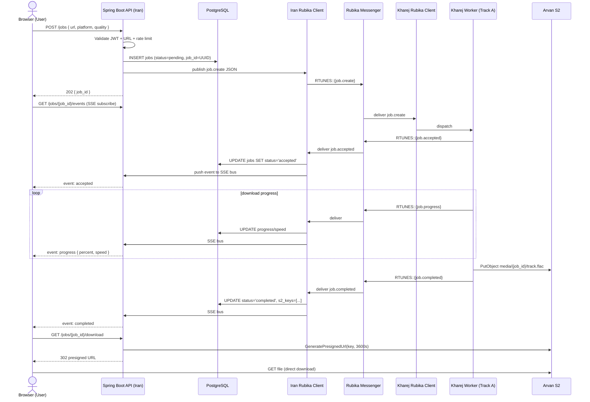
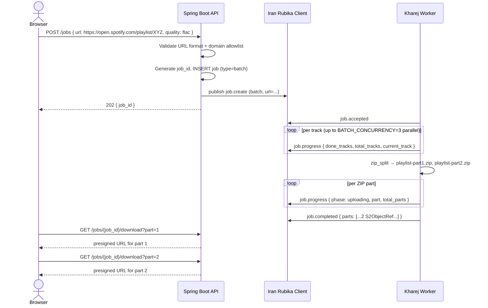
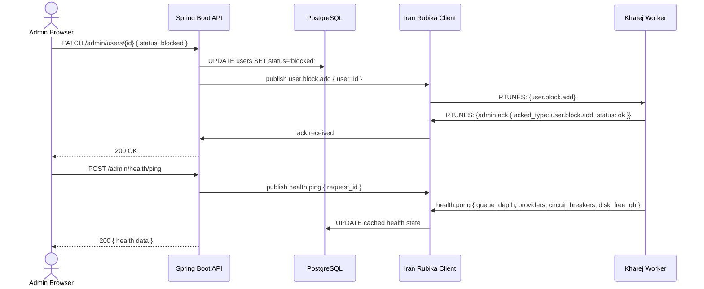

# Track B — Java Roadmap: Iran-Side UI / Service (Full Contracts + S2 + UI Mapping)

> **Status:** Authoritative implementation roadmap for Track B — "Iran VPS Web UI + Admin Panel + Auth"
>
> Companion to: [`task-split.md`](task-split.md) · [`architecture.md`](architecture.md) · [`message-schema.md`](message-schema.md) · [`CONTRACTS.md`](CONTRACTS.md) · [`track-a-steps.md`](track-a-steps.md)
>
> **Canonical contract source:** [`kharej/contracts.py`](../../../kharej/contracts.py)  
> **All JSON examples in this document are derived from that source — do not invent new message types.**

---

## Table of Contents

1. [Overview and Track Relationship](#1-overview-and-track-relationship)
2. [A — End-to-End Architecture Mapping](#a--end-to-end-architecture-mapping)
3. [B — Full Contract Documentation with JSON Examples](#b--full-contract-documentation-with-json-examples)
4. [C — Java Implementation Guide](#c--java-implementation-guide)
5. [D — UI Requirements](#d--ui-requirements)
6. [E — S2 Object Storage Details](#e--s2-object-storage-details)
7. [F — Step-by-Step Milestones](#f--step-by-step-milestones)

---

## 1. Overview and Track Relationship

**Track B** is the **Iran-side** half of the RubeTunes distributed system. It owns:

- The **Spring Boot REST API** (authentication, job management, admin operations).
- The **Iran-side Rubika client** that publishes `job.create` and admin control messages to the Kharej worker, and receives `job.progress`, `job.completed`, `job.failed`, `admin.ack`, and `health.pong` responses.
- The **React + TypeScript SPA** with RTL (Persian) layout.
- The **PostgreSQL database** for users, jobs, audit log, and settings.
- The **S2 read client** that generates presigned download URLs for the browser.

**Track A** (already implemented in `kharej/`) is the Kharej-side Python worker that:
- Receives `job.create` messages via Rubika.
- Downloads media and uploads to Arvan S2.
- Publishes `job.accepted`, `job.progress`, `job.completed`, `job.failed` back over Rubika.
- Handles all admin control messages (`user.whitelist.*`, `user.block.*`, `admin.*`, `health.*`).

The two tracks communicate **exclusively via Rubika text messages** using the frozen `v=1` contract defined in [`kharej/contracts.py`](../../../kharej/contracts.py). No binary data ever travels over Rubika. Media files live in Arvan S2 and are served to the browser via presigned URLs.

### Track ownership summary

| Component | Track A (Python/Kharej) | Track B (Java/Iran) |
|-----------|------------------------|---------------------|
| Rubika send/receive | ✅ (receive job.create; send progress) | ✅ (send job.create; receive progress) |
| S2 write (upload) | ✅ | ✗ |
| S2 read (presign) | ✗ | ✅ |
| PostgreSQL | ✗ | ✅ |
| Web UI (React) | ✗ | ✅ |
| JWT auth | ✗ | ✅ |
| Admin API | ✗ (receives control msgs) | ✅ (sends control msgs) |

---

## A — End-to-End Architecture Mapping

### A.1 Component Diagram

```
┌───────────────────────────── Iran VPS ──────────────────────────────┐
│                                                                      │
│  ┌──────────────────────┐    ┌────────────────────────────────────┐  │
│  │  React SPA (Vite +   │    │  Spring Boot API                   │  │
│  │  TypeScript, RTL)    │◄───┤  • /auth/*  (JWT, registration)   │  │
│  │  • Search / Result   │    │  • /jobs/*  (create, SSE, DL url) │  │
│  │  • Job Progress      │    │  • /library (history)             │  │
│  │  • Library           │    │  • /admin/* (users, settings, …)  │  │
│  │  • Admin Panel       │    └────────────────┬───────────────────┘  │
│  └──────────────────────┘                     │                      │
│                                               │                      │
│  ┌────────────────────────────────────────────▼───────────────────┐  │
│  │  Iran Rubika Client (rubpy or Java equivalent)                 │  │
│  │  • Sends:    job.create, job.cancel, user.whitelist.*, …       │  │
│  │  • Receives: job.accepted, job.progress, job.completed, …      │  │
│  │  • Pushes events to SSE bus → Spring Boot → browser           │  │
│  └─────────────────────────────┬──────────────────────────────────┘  │
│                                │ RTUNES:: JSON text messages          │
│  ┌─────────────────────────────▼──────────────────────────────────┐  │
│  │  PostgreSQL                                                     │  │
│  │  users · jobs · job_parts · audit_log · settings               │  │
│  │  refresh_tokens · registrations                                 │  │
│  └─────────────────────────────────────────────────────────────────┘  │
│                                                                      │
│  ┌──────────────────────────────────────────────────────────────────┐  │
│  │  S2 Read Client (AWS SDK v2, read-only creds)                   │  │
│  │  • generatePresignedUrl(key, 3600s TTL)                        │  │
│  │  • headObject(key) for existence check                         │  │
│  └──────────────────────────────────────────────────────────────────┘  │
└───────────────────────────────────────────────────────────────────────┘
                              │ Rubika Messenger
┌───────────────────────────── Kharej VPS ────────────────────────────┐
│  Kharej Rubika Client → Dispatcher → Downloaders → S2 Write Client  │
│  (Track A — kharej/worker.py, kharej/dispatcher.py, etc.)           │
└──────────────────────────────────────────────────────────────────────┘
                              │ S3-compatible API
┌───────────────────── Arvan S2 (rubetunes-media bucket) ─────────────┐
│  media/{job_id}/{filename}     ← written by Kharej, read by Iran    │
│  thumbs/{isrc_or_job_id}.jpg   ← written by Kharej, read by Iran    │
│  tmp/{job_id}/                 ← staging prefix, auto-deleted 24 h  │
└──────────────────────────────────────────────────────────────────────┘
```

### A.2 Request Flow: Typical Single-Track Download



### A.3 Request Flow: Batch Download (Playlist/Album)



### A.4 Admin Control Flow



---

## B — Full Contract Documentation with JSON Examples

> **Source of truth:** [`kharej/contracts.py`](../../../kharej/contracts.py)  
> All message types live in `AnyMessage` discriminated union, dispatched on the `type` field.  
> Wire format: `RTUNES::<json>` where `<json>` is UTF-8. Maximum wire size: **4 096 bytes**.

### B.0 Envelope (every message)

Every single message shares this base structure:

| Field | Type | Required | Description |
|-------|------|----------|-------------|
| `v` | integer | ✅ | Schema version. Always `1` for this contract. |
| `type` | string | ✅ | Message type discriminator. |
| `ts` | string (ISO-8601 UTC) | ✅ | Timestamp of message creation. |
| `job_id` | string (UUID v4) \| null | Context | Required for all job messages; `null` for admin/health. |

**Wire format:**
```
RTUNES::{"v":1,"type":"job.create","ts":"2026-04-26T17:05:56Z","job_id":"…",…}
```

Java receiving side: strip `RTUNES::` prefix, parse JSON, dispatch on `type`.

---

### B.1 `job.create` — Iran → Kharej

**Purpose:** Request a new download job. Iran VPS generates the `job_id` (UUID v4) and sends it to Kharej. This is the primary message Track B sends.

**When sent:** When a user submits a download request via `POST /jobs`.

**Expected reply:** `job.accepted` (immediately) then `job.progress` (periodic) then `job.completed` or `job.failed`.

**Single-track example:**

```json
{
  "v": 1,
  "type": "job.create",
  "ts": "2026-04-26T17:05:56Z",
  "job_id": "550e8400-e29b-41d4-a716-446655440000",
  "user_id": "f47ac10b-58cc-4372-a567-0e02b2c3d479",
  "user_status": "active",
  "platform": "spotify",
  "url": "https://open.spotify.com/track/4uLU6hMCjMI75M1A2tKUQC",
  "quality": "flac",
  "job_type": "single",
  "format_hint": null
}
```

**Batch (playlist/album) example:**

```json
{
  "v": 1,
  "type": "job.create",
  "ts": "2026-04-26T17:10:00Z",
  "job_id": "a1b2c3d4-e5f6-7890-abcd-ef1234567890",
  "user_id": "f47ac10b-58cc-4372-a567-0e02b2c3d479",
  "user_status": "active",
  "platform": "spotify",
  "url": "https://open.spotify.com/playlist/37i9dQZF1DXcBWIGoYBM5M",
  "quality": "mp3",
  "job_type": "batch",
  "format_hint": "mp3",
  "collection_name": null,
  "track_ids": null,
  "total_tracks": null,
  "batch_seq": null,
  "batch_total": null
}
```

> **Note:** Iran sends only the URL. The Kharej worker resolves the playlist, fetches all track IDs from the platform, and determines `total_tracks` itself. Iran never calls Spotify, YouTube, or any media platform API.

**Fields:**

| Field | Type | Required | Notes |
|-------|------|----------|-------|
| `user_id` | string (UUID) | ✅ | UUID of the requesting user (from DB `users.id`). |
| `user_status` | `"active"` \| `"admin"` | ✅ | User's current access level. |
| `platform` | `"youtube"` \| `"spotify"` \| `"tidal"` \| `"qobuz"` \| `"amazon"` \| `"soundcloud"` \| `"bandcamp"` \| `"musicdl"` | ✅ | Target media platform. |
| `url` | string | ✅ | Platform URL — **must be validated** on Iran side before sending (allowlist domains, reject private IPs). |
| `quality` | string | ✅ | `"mp3"` \| `"flac"` \| `"hires"` \| `"1080p"` \| `"720p"` \| etc. |
| `job_type` | `"single"` \| `"batch"` | ✅ | `"single"` for one track; `"batch"` for playlist/album. |
| `format_hint` | string \| null | ✗ | Optional format override (`"mp3"`, `"flac"`, `"m4a"`). |
| `collection_name` | string \| null | ✗ | Optional human-readable name the user entered. If null, Kharej derives it from the URL. |
| `track_ids` | null | ✗ | Always `null` — Iran never fetches track IDs. Kharej resolves them from the URL. |
| `total_tracks` | null | ✗ | Always `null` — Kharej determines the count after resolving the playlist/album. |
| `batch_seq` | null | ✗ | Reserved for future split-batch protocol. Always `null` for now. |
| `batch_total` | null | ✗ | Reserved for future split-batch protocol. Always `null` for now. |

**Error handling:** If Kharej cannot process the job, it replies with `job.failed`. The Iran side must update the DB job status accordingly and surface the error to the user.

---

### B.2 `job.accepted` — Kharej → Iran

**Purpose:** Acknowledge that the worker has queued the job.

**When received:** Shortly after `job.create` is delivered to Kharej.

**Action on receive:** Update `jobs.status = 'accepted'`, `jobs.accepted_at = ts`; push SSE event `{ type: "accepted", queue_position }` to the browser.

```json
{
  "v": 1,
  "type": "job.accepted",
  "ts": "2026-04-26T17:05:57Z",
  "job_id": "550e8400-e29b-41d4-a716-446655440000",
  "worker_version": "2.0.0",
  "queue_position": 1
}
```

| Field | Type | Notes |
|-------|------|-------|
| `worker_version` | string (semver) | Kharej worker version — log for debugging. |
| `queue_position` | integer (≥1) | 1 = being processed now; >1 = queued behind other jobs. |

---

### B.3 `job.progress` — Kharej → Iran

**Purpose:** Periodic progress update. Published at most once every 3 seconds per job (throttled by `ProgressReporter` in Track A).

**When received:** Update job row in DB; push SSE event to browser. Do **not** assume messages arrive in order — always use the `ts` field to discard stale updates.

**Action on receive:** `UPDATE jobs SET status='running', progress=percent, speed=speed WHERE id=job_id AND status != 'completed'`

**Single-file downloading:**

```json
{
  "v": 1,
  "type": "job.progress",
  "ts": "2026-04-26T17:06:00Z",
  "job_id": "550e8400-e29b-41d4-a716-446655440000",
  "phase": "downloading",
  "percent": 42,
  "speed": "3.2 MB/s",
  "eta_sec": 18
}
```

**Batch downloading (playlist):**

```json
{
  "v": 1,
  "type": "job.progress",
  "ts": "2026-04-26T17:11:00Z",
  "job_id": "a1b2c3d4-e5f6-7890-abcd-ef1234567890",
  "phase": "downloading",
  "percent": null,
  "speed": null,
  "eta_sec": null,
  "done_tracks": 12,
  "total_tracks": 50,
  "failed_tracks": 1,
  "current_track": "Shape of You — Ed Sheeran"
}
```

**Upload phase (ZIP part):**

```json
{
  "v": 1,
  "type": "job.progress",
  "ts": "2026-04-26T17:06:30Z",
  "job_id": "550e8400-e29b-41d4-a716-446655440000",
  "phase": "uploading",
  "percent": 75,
  "speed": "8.1 MB/s",
  "eta_sec": null,
  "part": 1,
  "total_parts": 2
}
```

| Field | Type | Notes |
|-------|------|-------|
| `phase` | `"downloading"` \| `"processing"` \| `"uploading"` \| `"zipping"` | Current phase. |
| `percent` | integer (0–100) \| null | Present for single files in downloading/uploading; null for batch. |
| `speed` | string \| null | Human-readable speed string. |
| `eta_sec` | integer (≥0) \| null | Best-effort ETA in seconds. |
| `done_tracks` | integer (≥0) \| null | Batch jobs: tracks completed so far. |
| `total_tracks` | integer (≥1) \| null | Batch jobs: total track count. |
| `failed_tracks` | integer (≥0) \| null | Batch jobs: tracks that failed (partial failure). |
| `current_track` | string \| null | Batch jobs: title of the track being processed. |
| `part` | integer (≥1) \| null | Multipart ZIP upload: current part number. |
| `total_parts` | integer (≥1) \| null | Multipart ZIP upload: total part count. |

---

### B.4 `job.completed` — Kharej → Iran

**Purpose:** All files are uploaded to S2. Includes the full list of S2 object references.

**When received:** Mark job `status = 'completed'`; store `s2_keys` JSON array in DB; push SSE event `{ type: "completed" }`; the browser can now show download buttons.

**Single-file example:**

```json
{
  "v": 1,
  "type": "job.completed",
  "ts": "2026-04-26T17:07:15Z",
  "job_id": "550e8400-e29b-41d4-a716-446655440000",
  "parts": [
    {
      "key": "media/550e8400-e29b-41d4-a716-446655440000/Shape_of_You.flac",
      "size": 34205696,
      "mime": "audio/flac",
      "sha256": "e3b0c44298fc1c149afbf4c8996fb92427ae41e4649b934ca495991b7852b855"
    }
  ],
  "metadata": {
    "title": "Shape of You",
    "artists": ["Ed Sheeran"],
    "album": "÷ (Divide)",
    "duration_sec": 234,
    "isrc": "GBAHS1600463",
    "source": "qobuz",
    "quality": "flac"
  }
}
```

**Multi-part ZIP example (batch):**

```json
{
  "v": 1,
  "type": "job.completed",
  "ts": "2026-04-26T17:25:00Z",
  "job_id": "a1b2c3d4-e5f6-7890-abcd-ef1234567890",
  "parts": [
    {
      "key": "media/a1b2c3d4-e5f6-7890-abcd-ef1234567890/TodaysTopHits-part1.zip",
      "size": 2094006272,
      "mime": "application/zip",
      "sha256": "abc123def456abc123def456abc123def456abc123def456abc123def456abc123"
    },
    {
      "key": "media/a1b2c3d4-e5f6-7890-abcd-ef1234567890/TodaysTopHits-part2.zip",
      "size": 512000000,
      "mime": "application/zip",
      "sha256": "def456abc123def456abc123def456abc123def456abc123def456abc123def456"
    }
  ],
  "metadata": {
    "collection_name": "Today's Top Hits",
    "total_tracks": 50,
    "downloaded_tracks": 49,
    "failed_tracks": 1,
    "quality": "mp3"
  }
}
```

**`S2ObjectRef` fields (each element in `parts`):**

| Field | Type | Description |
|-------|------|-------------|
| `key` | string | Bucket-relative S2 object key. Pattern: `media/{job_id}/{safe_filename}`. |
| `size` | integer (≥0) | Exact file size in bytes. |
| `mime` | string | MIME type (e.g., `"audio/flac"`, `"audio/mpeg"`, `"application/zip"`, `"video/mp4"`). |
| `sha256` | string | Lowercase hex-encoded SHA-256. Use to verify integrity after download. |

**`metadata` object:** Unstructured `Map<String, Object>`. Always present but may be empty `{}`. Parse defensively; never fail on missing or extra keys.

**Integrity verification on Iran side:**
```
for each part in parts:
    headObject(part.key) → check that size matches part.size
    (optional) download + verify SHA-256 if proxy-streaming
```

---

### B.5 `job.failed` — Kharej → Iran

**Purpose:** The job could not be completed.

**When received:** Mark job `status = 'failed'`; store `error_code`, `error_msg`; push SSE event; show user-facing error with retry button if `retryable = true`.

```json
{
  "v": 1,
  "type": "job.failed",
  "ts": "2026-04-26T17:06:45Z",
  "job_id": "550e8400-e29b-41d4-a716-446655440000",
  "error_code": "no_source_available",
  "message": "All download sources exhausted for this track.",
  "retryable": false
}
```

**All error codes (from `contracts.py`):**

| Code | User-visible message (Persian) | Retryable | Notes |
|------|-------------------------------|-----------|-------|
| `no_source_available` | همه منابع دانلود آزمایش شدند | `false` | Circuit breaker exhausted all providers. |
| `s2_upload_failed` | بارگذاری فایل ناموفق بود | `true` | S2 upload failed after 5 retries. |
| `download_timeout` | دانلود در زمان مقرر انجام نشد | `true` | Provider timed out. |
| `rate_limited` | محدودیت نرخ ارائه‌دهنده | `true` | Provider returned 429. |
| `invalid_url` | آدرس اینترنتی نامعتبر است | `false` | Should be caught by Iran-side validation. |
| `access_denied` | دسترسی شما مجاز نیست | `false` | User blocked or not whitelisted. |
| `disk_space_error` | فضای دیسک Kharej پر است | `false` | Admin must intervene. |
| `internal_error` | خطای داخلی سرور | `true` | Generic exception. |
| `blocked` | حساب کاربری شما مسدود شده است | `false` | User in blocklist. |
| `not_whitelisted` | حساب کاربری شما هنوز تایید نشده است | `false` | User not yet approved. |
| `unsupported_platform` | پلتفرم پشتیبانی نمی‌شود | `false` | Platform not in `Platform` enum. |
| `duplicate_job` | این دانلود قبلاً در صف است | `false` | Same `job_id` already running. |
| `cancelled` | دانلود لغو شد | `false` | User or admin cancelled. |
| `timeout` | زمان کار تمام شد | `true` | Hard per-job timeout (1 h). |
| `not_implemented` | این ویژگی پیاده‌سازی نشده است | `false` | Stub downloader reply. |
| `error` | خطای ناشناخته | `true` | Generic fallback. |
| `shutdown` | سرور در حال خاموش شدن است | `true` | Worker shutdown during job. |

---

### B.6 `job.cancel` — Iran → Kharej

**Purpose:** Cancel an in-progress job.

**When sent:** User clicks "Cancel" on the job progress page, or admin cancels from the admin queue.

**Action:** Publish `job.cancel` over Rubika. The Kharej worker will cancel the asyncio task and reply with `job.failed { error_code: "cancelled" }`.

```json
{
  "v": 1,
  "type": "job.cancel",
  "ts": "2026-04-26T17:06:50Z",
  "job_id": "550e8400-e29b-41d4-a716-446655440000"
}
```

**Error handling:** The cancel may arrive after the job already completed. Ignore `job.failed { cancelled }` if the job is already in `completed` state in the DB.

---

### B.7 `user.whitelist.add` — Iran → Kharej

**Purpose:** Add a user to the Kharej worker's local access whitelist. Called when an admin approves a pending registration.

**Expected reply:** `admin.ack { acked_type: "user.whitelist.add", status: "ok" }`

```json
{
  "v": 1,
  "type": "user.whitelist.add",
  "ts": "2026-04-26T18:00:00Z",
  "job_id": null,
  "user_id": "f47ac10b-58cc-4372-a567-0e02b2c3d479",
  "display_name": "Ali Rezaei"
}
```

| Field | Type | Notes |
|-------|------|-------|
| `user_id` | string (UUID) | Must match `users.id` in the DB. |
| `display_name` | string \| null | Optional human-readable name (logged by Kharej for auditing). |

---

### B.8 `user.whitelist.remove` — Iran → Kharej

**Purpose:** Remove a user from the Kharej whitelist. Called when an admin revokes access or deletes a user.

**Expected reply:** `admin.ack { acked_type: "user.whitelist.remove", status: "ok" }`

```json
{
  "v": 1,
  "type": "user.whitelist.remove",
  "ts": "2026-04-26T18:01:00Z",
  "job_id": null,
  "user_id": "f47ac10b-58cc-4372-a567-0e02b2c3d479"
}
```

---

### B.9 `user.block.add` — Iran → Kharej

**Purpose:** Block a user on the Kharej side. Any in-flight jobs for this user will be rejected on next access check.

**Expected reply:** `admin.ack { acked_type: "user.block.add", status: "ok" }`

```json
{
  "v": 1,
  "type": "user.block.add",
  "ts": "2026-04-26T18:05:00Z",
  "job_id": null,
  "user_id": "f47ac10b-58cc-4372-a567-0e02b2c3d479",
  "reason": "Spam detected"
}
```

| Field | Notes |
|-------|-------|
| `reason` | Optional; logged by Kharej for auditing. Not shown to the user. |

---

### B.10 `user.block.remove` — Iran → Kharej

**Purpose:** Unblock a user previously blocked with `user.block.add`.

**Expected reply:** `admin.ack { acked_type: "user.block.remove", status: "ok" }`

```json
{
  "v": 1,
  "type": "user.block.remove",
  "ts": "2026-04-26T18:06:00Z",
  "job_id": null,
  "user_id": "f47ac10b-58cc-4372-a567-0e02b2c3d479"
}
```

---

### B.11 `admin.clearcache` — Iran → Kharej

**Purpose:** Flush metadata caches on the Kharej worker. Useful after updating provider credentials.

**Expected reply:** `admin.ack { acked_type: "admin.clearcache", status: "ok" }`

```json
{
  "v": 1,
  "type": "admin.clearcache",
  "ts": "2026-04-26T18:15:00Z",
  "job_id": null,
  "target": "all"
}
```

| `target` | Effect |
|----------|--------|
| `"lru"` | Flush the LRU metadata cache (track info, search results). |
| `"isrc"` | Flush the ISRC → platform resolution disk cache. |
| `"all"` | Flush both. |

---

### B.12 `admin.settings.update` — Iran → Kharej

**Purpose:** Push runtime configuration changes to the Kharej worker without redeployment.

**Expected reply:** `admin.ack { acked_type: "admin.settings.update", status: "ok", effective_config: {...} }`

```json
{
  "v": 1,
  "type": "admin.settings.update",
  "ts": "2026-04-26T18:20:00Z",
  "job_id": null,
  "settings": {
    "BATCH_CONCURRENCY": 4,
    "USER_TRACKS_PER_HOUR": 50,
    "CIRCUIT_FAIL_THRESHOLD": 5,
    "DEEZER_ARL": "new_arl_value_here"
  }
}
```

**`settings` object:** Arbitrary `Map<String, Object>`. Keys are the `KHAREJ_*` env var names (without the `KHAREJ_` prefix, lowercase). The Kharej worker (`KharejSettings.handle_settings_update`) applies each key, persists to `kharej_settings.json`, and returns the full effective config.

⚠️ Secrets (ARL, tokens) travel over Rubika messages (end-to-end encrypted by Rubika). For extra safety, use `admin.cookies.update` + S2 for large secret files.

---

### B.13 `admin.cookies.update` — Iran → Kharej

**Purpose:** Replace the `cookies.txt` file on the Kharej worker. The file may exceed 4 KB, so it is uploaded to S2 first.

**Workflow:**
1. Admin uploads the new `cookies.txt` to S2 at `tmp/cookies-update-{timestamp}.txt` using the **Iran-side read credentials** (which also need `PutObject` on `tmp/`). Alternatively, Iran can have a separate `tmp/`-write credential.
2. Iran sends `admin.cookies.update` with the S2 key and SHA-256.
3. Kharej downloads the file, verifies the hash, replaces `cookies.txt`, deletes the temp S2 object.
4. Kharej sends `admin.ack { status: "ok" }`.

**Expected reply:** `admin.ack { acked_type: "admin.cookies.update", status: "ok" | "error" }`

```json
{
  "v": 1,
  "type": "admin.cookies.update",
  "ts": "2026-04-26T18:25:00Z",
  "job_id": null,
  "s2_key": "tmp/cookies-update-2026-04-26.txt",
  "sha256": "abc123def456abc123def456abc123def456abc123def456abc123def456abc123"
}
```

| Field | Notes |
|-------|-------|
| `s2_key` | Must start with `tmp/`. The Kharej worker will `GetObject` then delete it. |
| `sha256` | Hex-encoded SHA-256 of the **raw** cookies file content. |

---

### B.14 `admin.ack` — Kharej → Iran

**Purpose:** Generic acknowledgement for all admin control messages. Always sent by Kharej in response to any admin/user-control message.

**Action on receive:** Log the ack. If `status == "error"`, surface an alert in the Admin Panel. For `admin.settings.update` ack, update the displayed effective config.

```json
{
  "v": 1,
  "type": "admin.ack",
  "ts": "2026-04-26T18:00:01Z",
  "job_id": null,
  "acked_type": "user.whitelist.add",
  "status": "ok",
  "detail": null,
  "effective_config": null
}
```

`admin.settings.update` ack (includes `effective_config`):

```json
{
  "v": 1,
  "type": "admin.ack",
  "ts": "2026-04-26T18:20:01Z",
  "job_id": null,
  "acked_type": "admin.settings.update",
  "status": "ok",
  "detail": null,
  "effective_config": {
    "batch_concurrency": 4,
    "user_tracks_per_hour": 50,
    "circuit_fail_threshold": 5,
    "progress_throttle_seconds": 3
  }
}
```

Error ack:

```json
{
  "v": 1,
  "type": "admin.ack",
  "ts": "2026-04-26T18:25:10Z",
  "job_id": null,
  "acked_type": "admin.cookies.update",
  "status": "error",
  "detail": "SHA-256 mismatch: expected abc123, got xyz999",
  "effective_config": null
}
```

| Field | Type | Notes |
|-------|------|-------|
| `acked_type` | string | The `type` value of the control message being acknowledged. |
| `status` | `"ok"` \| `"error"` | Result of the operation. |
| `detail` | string \| null | Human-readable detail, especially for errors. |
| `effective_config` | `Map<String, Object>` \| null | Only populated by `admin.settings.update` ack; contains the full effective config. |

---

### B.15 `health.ping` — Iran → Kharej

**Purpose:** Request a health status snapshot from the Kharej worker.

**When sent:** Admin opens `/admin/health` or clicks "Re-check all". Sent at most once per 30 seconds to avoid hammering the worker.

**Expected reply:** `health.pong` (within a few seconds).

```json
{
  "v": 1,
  "type": "health.ping",
  "ts": "2026-04-26T18:10:00Z",
  "job_id": null,
  "request_id": "ping-abc123"
}
```

| Field | Notes |
|-------|-------|
| `request_id` | Opaque string echoed back in `health.pong`. Use a UUID or timestamp-based string for correlation. |

---

### B.16 `health.pong` — Kharej → Iran

**Purpose:** Detailed health status response.

**Action on receive:** Cache in DB (`kharej_health` table or similar); update the Admin Panel health view.

```json
{
  "v": 1,
  "type": "health.pong",
  "ts": "2026-04-26T18:10:01Z",
  "job_id": null,
  "request_id": "ping-abc123",
  "worker_version": "2.0.0",
  "queue_depth": 3,
  "circuit_breakers": [
    {
      "key": "qobuz",
      "state": "closed",
      "consecutive_failures": 0,
      "seconds_until_close": null
    },
    {
      "key": "deezer",
      "state": "open",
      "consecutive_failures": 4,
      "seconds_until_close": 312
    },
    {
      "key": "tidal_alt",
      "state": "half-open",
      "consecutive_failures": 2,
      "seconds_until_close": null
    }
  ],
  "providers": [
    { "name": "Qobuz", "status": "up", "response_ms": 145 },
    { "name": "Deezer", "status": "down", "response_ms": null },
    { "name": "YouTube Music", "status": "up", "response_ms": 201 },
    { "name": "Arvan S2", "status": "up", "response_ms": 89 }
  ],
  "disk_free_gb": 42.3,
  "uptime_sec": 86400
}
```

**`CircuitBreakerState` fields:**

| Field | Type | Notes |
|-------|------|-------|
| `key` | string | Provider identifier (e.g. `"qobuz"`, `"deezer"`). |
| `state` | `"closed"` \| `"open"` \| `"half-open"` | Circuit breaker state. |
| `consecutive_failures` | integer (≥0) | Number of recent consecutive failures. |
| `seconds_until_close` | integer \| null | Only present when `state == "open"`. |

**`ProviderStatus` fields:**

| Field | Type | Notes |
|-------|------|-------|
| `name` | string | Human-readable provider name. |
| `status` | `"up"` \| `"degraded"` \| `"down"` | Current health. |
| `response_ms` | integer \| null | Last measured response time; `null` if unreachable. |

**Other fields:**

| Field | Notes |
|-------|-------|
| `worker_version` | Semver string — used to detect stale worker deployments. |
| `queue_depth` | Number of jobs in the Kharej internal queue. Show in Admin Dashboard. |
| `disk_free_gb` | Free disk on Kharej VPS. Alert if < 5 GB. |
| `uptime_sec` | Worker process uptime. Show in Admin Dashboard. |

---

### B.17 Message Routing Summary

| Direction | Type | Track B Sends | Track B Receives |
|-----------|------|:---:|:---:|
| Iran → Kharej | `job.create` | ✅ | |
| Kharej → Iran | `job.accepted` | | ✅ |
| Kharej → Iran | `job.progress` | | ✅ |
| Kharej → Iran | `job.completed` | | ✅ |
| Kharej → Iran | `job.failed` | | ✅ |
| Iran → Kharej | `job.cancel` | ✅ | |
| Iran → Kharej | `user.whitelist.add` | ✅ | |
| Iran → Kharej | `user.whitelist.remove` | ✅ | |
| Iran → Kharej | `user.block.add` | ✅ | |
| Iran → Kharej | `user.block.remove` | ✅ | |
| Iran → Kharej | `admin.clearcache` | ✅ | |
| Iran → Kharej | `admin.settings.update` | ✅ | |
| Iran → Kharej | `admin.cookies.update` | ✅ | |
| Kharej → Iran | `admin.ack` | | ✅ |
| Iran → Kharej | `health.ping` | ✅ | |
| Kharej → Iran | `health.pong` | | ✅ |

---

## C — Java Implementation Guide

### C.1 Recommended Stack

| Layer | Technology | Reason |
|-------|-----------|--------|
| **Framework** | Spring Boot 3.3+ (Java 21) | Production-grade ecosystem; virtual threads (Project Loom) for SSE; native GraalVM compilation if needed. |
| **REST / SSE** | Spring Web MVC + `SseEmitter` | SSE is first-class in Spring MVC; no reactive boilerplate needed. |
| **Async Rubika bridge** | Spring `@EventListener` + `ApplicationEventPublisher` | Decouples the Rubika receive thread from HTTP request threads. |
| **JSON** | Jackson 2.17+ | Industry standard; `@JsonTypeInfo` for discriminated union dispatch. |
| **Validation** | Hibernate Validator (Bean Validation 3) | Mirrors Pydantic constraints from `contracts.py`. |
| **Database** | Spring Data JPA + PostgreSQL 16 | Aligns with Track A architecture recommendations. |
| **Migrations** | Flyway | Simpler than Liquibase for this scale. |
| **Auth** | Spring Security 6 + JJWT | JWT access tokens + httpOnly refresh cookie. |
| **S2 client** | AWS SDK for Java v2 (`software.amazon.awssdk:s3`) | S3-compatible; supports presigned URLs, async operations. |
| **Rubika client** | `rubpy` Python process via subprocess OR `ProcessBuilder` bridge | See §C.4 for detailed options. |
| **Build** | Gradle (Kotlin DSL) | Modern, incremental builds. |
| **Testing** | JUnit 5 + Mockito + Testcontainers (PostgreSQL) | Standard Spring Boot test stack. |

**Minimum Java version:** Java 21 (for virtual threads via `spring.threads.virtual.enabled=true`).

---

### C.2 Project Structure

```
iran/
├── src/
│   └── main/
│       ├── java/ir/rubetunes/
│       │   ├── IranApplication.java
│       │   ├── config/
│       │   │   ├── SecurityConfig.java
│       │   │   ├── S2Config.java
│       │   │   └── RubikaConfig.java
│       │   ├── contracts/               ← Java mirror of kharej/contracts.py
│       │   │   ├── Envelope.java
│       │   │   ├── JobCreate.java
│       │   │   ├── JobAccepted.java
│       │   │   ├── JobProgress.java
│       │   │   ├── JobCompleted.java
│       │   │   ├── JobFailed.java
│       │   │   ├── JobCancel.java
│       │   │   ├── UserWhitelistAdd.java
│       │   │   ├── UserWhitelistRemove.java
│       │   │   ├── UserBlockAdd.java
│       │   │   ├── UserBlockRemove.java
│       │   │   ├── AdminClearcache.java
│       │   │   ├── AdminSettingsUpdate.java
│       │   │   ├── AdminCookiesUpdate.java
│       │   │   ├── AdminAck.java
│       │   │   ├── HealthPing.java
│       │   │   ├── HealthPong.java
│       │   │   ├── S2ObjectRef.java
│       │   │   └── MessageDispatcher.java  ← decode() + route()
│       │   ├── domain/
│       │   │   ├── User.java               ← JPA entity
│       │   │   ├── Job.java                ← JPA entity
│       │   │   ├── JobPart.java            ← JPA entity (S2ObjectRef rows)
│       │   │   ├── AuditLog.java
│       │   │   └── Settings.java
│       │   ├── repository/
│       │   │   ├── UserRepository.java
│       │   │   ├── JobRepository.java
│       │   │   └── SettingsRepository.java
│       │   ├── service/
│       │   │   ├── JobService.java         ← create, cancel, download URL
│       │   │   ├── RubikaService.java      ← send/receive over Rubika
│       │   │   ├── S2Service.java          ← presign, headObject
│       │   │   ├── SseBusService.java      ← SSE fanout
│       │   │   ├── AdminService.java       ← user approve/block + control msgs
│       │   │   └── HealthService.java      ← ping/pong + cache
│       │   ├── api/
│       │   │   ├── AuthController.java
│       │   │   ├── JobController.java
│       │   │   ├── LibraryController.java
│       │   │   ├── AdminController.java
│       │   │   └── HealthController.java
│       │   └── rubika/
│       │       ├── RubikaClient.java       ← transport abstraction
│       │       └── RubikaEventHandler.java ← inbound message handler
│       └── resources/
│           ├── application.yml
│           └── db/migration/               ← Flyway SQL
│               ├── V1__initial_schema.sql
│               └── V2__add_job_parts.sql
├── build.gradle.kts
└── Dockerfile
```

---

### C.3 DTO Modeling (Jackson)

#### C.3.1 Envelope Sealed Interface

Use a sealed interface with `@JsonTypeInfo` for discriminated union dispatch, mirroring the `AnyMessage` type from `contracts.py`.

```java
// contracts/Envelope.java
@JsonTypeInfo(use = JsonTypeInfo.Id.NAME, property = "type")
@JsonSubTypes({
    @JsonSubTypes.Type(value = JobCreate.class,           name = "job.create"),
    @JsonSubTypes.Type(value = JobAccepted.class,         name = "job.accepted"),
    @JsonSubTypes.Type(value = JobProgress.class,         name = "job.progress"),
    @JsonSubTypes.Type(value = JobCompleted.class,        name = "job.completed"),
    @JsonSubTypes.Type(value = JobFailed.class,           name = "job.failed"),
    @JsonSubTypes.Type(value = JobCancel.class,           name = "job.cancel"),
    @JsonSubTypes.Type(value = UserWhitelistAdd.class,    name = "user.whitelist.add"),
    @JsonSubTypes.Type(value = UserWhitelistRemove.class, name = "user.whitelist.remove"),
    @JsonSubTypes.Type(value = UserBlockAdd.class,        name = "user.block.add"),
    @JsonSubTypes.Type(value = UserBlockRemove.class,     name = "user.block.remove"),
    @JsonSubTypes.Type(value = AdminClearcache.class,     name = "admin.clearcache"),
    @JsonSubTypes.Type(value = AdminSettingsUpdate.class, name = "admin.settings.update"),
    @JsonSubTypes.Type(value = AdminCookiesUpdate.class,  name = "admin.cookies.update"),
    @JsonSubTypes.Type(value = AdminAck.class,            name = "admin.ack"),
    @JsonSubTypes.Type(value = HealthPing.class,          name = "health.ping"),
    @JsonSubTypes.Type(value = HealthPong.class,          name = "health.pong"),
})
public sealed interface Envelope permits
    JobCreate, JobAccepted, JobProgress, JobCompleted, JobFailed, JobCancel,
    UserWhitelistAdd, UserWhitelistRemove, UserBlockAdd, UserBlockRemove,
    AdminClearcache, AdminSettingsUpdate, AdminCookiesUpdate, AdminAck,
    HealthPing, HealthPong {

    int getV();
    String getType();
    Instant getTs();
    @Nullable String getJobId();
}
```

#### C.3.2 Concrete DTO Example: `JobCreate`

```java
// contracts/JobCreate.java
@JsonDeserialize
public record JobCreate(
    @JsonProperty("v") int v,
    @JsonProperty("type") String type,
    @JsonProperty("ts") Instant ts,
    @JsonProperty("job_id") @Nullable String jobId,

    @JsonProperty("user_id") @NotBlank String userId,
    @JsonProperty("user_status") @NotNull UserStatus userStatus,
    @JsonProperty("platform") @NotNull Platform platform,
    @JsonProperty("url") @NotBlank @Size(max = 2048) String url,
    @JsonProperty("quality") @NotBlank @Size(max = 50) String quality,
    @JsonProperty("job_type") @NotNull JobType jobType,
    @JsonProperty("format_hint") @Nullable String formatHint,

    // Batch-only
    @JsonProperty("collection_name") @Nullable String collectionName,
    @JsonProperty("track_ids") @Nullable List<String> trackIds,
    @JsonProperty("total_tracks") @Nullable @Min(1) Integer totalTracks,
    @JsonProperty("batch_seq") @Nullable @Min(1) Integer batchSeq,
    @JsonProperty("batch_total") @Nullable @Min(1) Integer batchTotal
) implements Envelope {

    // Default v and type to match the contract constants.
    public JobCreate {
        if (v != 1) throw new IllegalArgumentException("Unsupported contract version: " + v);
    }
}
```

#### C.3.3 Supporting Enums

```java
// Mirrors kharej/contracts.py Platform enum
public enum Platform {
    @JsonProperty("youtube")    YOUTUBE,
    @JsonProperty("spotify")    SPOTIFY,
    @JsonProperty("tidal")      TIDAL,
    @JsonProperty("qobuz")      QOBUZ,
    @JsonProperty("amazon")     AMAZON,
    @JsonProperty("soundcloud") SOUNDCLOUD,
    @JsonProperty("bandcamp")   BANDCAMP,
    @JsonProperty("musicdl")    MUSICDL
}

// Mirrors kharej/contracts.py JobStatus enum
public enum JobStatus {
    @JsonProperty("pending")    PENDING,
    @JsonProperty("accepted")   ACCEPTED,
    @JsonProperty("running")    RUNNING,
    @JsonProperty("completed")  COMPLETED,
    @JsonProperty("failed")     FAILED,
    @JsonProperty("cancelled")  CANCELLED
}

public enum JobType {
    @JsonProperty("single") SINGLE,
    @JsonProperty("batch")  BATCH
}

public enum UserStatus {
    @JsonProperty("active") ACTIVE,
    @JsonProperty("admin")  ADMIN
}
```

#### C.3.4 `S2ObjectRef` DTO

```java
// contracts/S2ObjectRef.java
public record S2ObjectRef(
    @JsonProperty("key")    @NotBlank String key,
    @JsonProperty("size")   @Min(0)   long size,
    @JsonProperty("mime")   @NotBlank String mime,
    @JsonProperty("sha256") @NotBlank String sha256
) {}
```

#### C.3.5 `HealthPong` DTO (nested types)

```java
public record CircuitBreakerState(
    @JsonProperty("key")                  String key,
    @JsonProperty("state")                String state,         // "closed"|"open"|"half-open"
    @JsonProperty("consecutive_failures") int consecutiveFailures,
    @JsonProperty("seconds_until_close")  @Nullable Integer secondsUntilClose
) {}

public record ProviderStatus(
    @JsonProperty("name")        String name,
    @JsonProperty("status")      String status,       // "up"|"degraded"|"down"
    @JsonProperty("response_ms") @Nullable Integer responseMs
) {}

public record HealthPong(
    @JsonProperty("v") int v,
    @JsonProperty("type") String type,
    @JsonProperty("ts") Instant ts,
    @JsonProperty("job_id") @Nullable String jobId,
    @JsonProperty("request_id")      String requestId,
    @JsonProperty("worker_version")   String workerVersion,
    @JsonProperty("queue_depth")      int queueDepth,
    @JsonProperty("circuit_breakers") List<CircuitBreakerState> circuitBreakers,
    @JsonProperty("providers")        List<ProviderStatus> providers,
    @JsonProperty("disk_free_gb")     double diskFreeGb,
    @JsonProperty("uptime_sec")       long uptimeSec
) implements Envelope {}
```

#### C.3.6 Versioning Strategy

All DTOs validate `v == 1` in their compact constructor. If `v > 1` arrives (future version), skip with a warning:

```java
// MessageDispatcher.java
public static final int SUPPORTED_VERSION = 1;
private static final String RTUNES_PREFIX = "RTUNES::";

public Optional<Envelope> decode(String raw) {
    if (!raw.startsWith(RTUNES_PREFIX)) {
        log.warn("Rejected non-RTUNES message");
        return Optional.empty();
    }
    String json = raw.substring(RTUNES_PREFIX.length());
    try {
        JsonNode root = objectMapper.readTree(json);
        int v = root.path("v").asInt(-1);
        if (v > SUPPORTED_VERSION) {
            log.warn("Skipping message with unsupported version v={}", v);
            return Optional.empty();
        }
        return Optional.of(objectMapper.treeToValue(root, Envelope.class));
    } catch (JsonProcessingException e) {
        log.warn("Failed to parse Rubika message: {}", e.getMessage());
        return Optional.empty();
    }
}

public String encode(Envelope msg) {
    try {
        return RTUNES_PREFIX + objectMapper.writeValueAsString(msg);
    } catch (JsonProcessingException e) {
        throw new IllegalStateException("Failed to encode message", e);
    }
}
```

Jackson `ObjectMapper` configuration:

```java
@Bean
public ObjectMapper objectMapper() {
    return JsonMapper.builder()
        .addModule(new JavaTimeModule())
        .configure(SerializationFeature.WRITE_DATES_AS_TIMESTAMPS, false)
        .configure(DeserializationFeature.FAIL_ON_UNKNOWN_PROPERTIES, false) // ignore unknown fields
        .build();
}
```

`FAIL_ON_UNKNOWN_PROPERTIES = false` is **required** so that future optional fields added by Track A do not break the Iran-side deserializer.

---

### C.4 Rubika Integration

#### C.4.1 Architecture Options

The Kharej side uses `rubpy` (Python library). For the Iran side, two options exist:

**Option A — Python subprocess bridge (recommended for MVP):**

Run a small Python `rubpy` process alongside the Spring Boot application. Bridge over stdin/stdout (newline-delimited JSON). This reuses the same `rubpy` library and avoids reimplementing Rubika's wire protocol in Java.

```
Spring Boot ←─ stdin/stdout JSON bridge ─→ iran_rubika_bridge.py (rubpy)
```

```python
# iran/rubika_bridge.py
import asyncio, json, sys
import rubpy

async def main():
    client = rubpy.Client(name=os.environ["RUBIKA_SESSION_IRAN"])
    async with client:
        @client.on_message_updates()
        async def on_msg(update):
            text = update.text or ""
            guid = getattr(update, "object_guid", "")
            print(json.dumps({"event": "message", "sender_guid": guid, "text": text}),
                  flush=True)

        # Read outbound messages from stdin
        async def read_stdin():
            loop = asyncio.get_event_loop()
            reader = asyncio.StreamReader()
            await loop.connect_read_pipe(lambda: asyncio.StreamReaderProtocol(reader), sys.stdin)
            while True:
                line = await reader.readline()
                if not line:
                    break
                payload = json.loads(line)
                await client.send_message(
                    object_guid=payload["to"],
                    text=payload["text"]
                )

        await asyncio.gather(client.run(), read_stdin())

asyncio.run(main())
```

Spring Boot side:

```java
@Service
public class RubikaClient {
    private final Process process;
    private final PrintWriter writer;

    public RubikaClient(@Value("${rubika.bridge.command}") String cmd) {
        this.process = new ProcessBuilder(cmd.split(" "))
            .redirectErrorStream(true)
            .start();
        this.writer = new PrintWriter(process.getOutputStream(), true);
        // Start reading thread
        Thread.ofVirtual().start(this::readLoop);
    }

    public void send(String toGuid, String text) {
        writer.println(objectMapper.writeValueAsString(
            Map.of("to", toGuid, "text", text)));
    }

    private void readLoop() {
        try (var reader = new BufferedReader(new InputStreamReader(process.getInputStream()))) {
            String line;
            while ((line = reader.readLine()) != null) {
                JsonNode node = objectMapper.readTree(line);
                if ("message".equals(node.path("event").asText())) {
                    handleInbound(node.path("sender_guid").asText(),
                                  node.path("text").asText());
                }
            }
        }
    }
}
```

**Option B — Pure Java rubpy-compatible client (advanced):**

Implement the Rubika wire protocol in Java. This is more work but eliminates the Python dependency. Use `rubpy`'s reverse-engineered protocol — there are community Kotlin/Java ports available (search `rubika-java`). Only recommended if the subprocess bridge causes operational pain.

#### C.4.2 Reconnect and Backoff

Mirror the Track A `RubikaClient._supervisor()` logic:

```java
@Scheduled(fixedDelay = 100)
public void superviseConnection() {
    if (!rubikaClient.isConnected()) {
        reconnectWithBackoff();
    }
}

private void reconnectWithBackoff() {
    double backoff = 1.0;  // seconds
    while (!rubikaClient.isConnected()) {
        try { Thread.sleep((long)(backoff * 1000)); } catch (InterruptedException ignored) {}
        try {
            rubikaClient.connect(kharejAccountGuid);
            backoff = 1.0;  // reset
        } catch (Exception e) {
            log.warn("Rubika reconnect failed: {}", e.getMessage());
            backoff = Math.min(backoff * 2, 30.0);  // cap at 30 s
        }
    }
}
```

#### C.4.3 Idempotency

The Iran side generates `job_id` (UUID v4) before sending `job.create`. Store the `job_id` in the DB with a `UNIQUE` constraint. On duplicate delivery of the same `job.accepted`/`job.progress`/`job.completed`, use `ON CONFLICT DO NOTHING` or check in the event handler:

```java
public void handleJobProgress(JobProgress msg) {
    jobRepository.findById(UUID.fromString(msg.jobId()))
        .filter(job -> !job.getStatus().isTerminal())
        .ifPresent(job -> {
            job.setProgress(msg.percent());
            job.setSpeed(msg.speed());
            jobRepository.save(job);
            sseBus.publish(msg.jobId(), msg);
        });
}
```

---

### C.5 Job Lifecycle State Machine

Mirror the `JobStatus` enum from `contracts.py`:

```
pending → accepted → running → completed
                   → failed
                   → cancelled
```

**State transitions owned by Track B (Iran):**

| Trigger | Transition |
|---------|-----------|
| `POST /jobs` | → `pending` |
| Receive `job.cancel` (user) | `pending` or `running` → `cancelled` + send `job.cancel` to Kharej |
| Admin cancel | `pending` or `running` → `cancelled` + send `job.cancel` to Kharej |

**State transitions triggered by Track A messages:**

| Message received | Transition |
|-----------------|-----------|
| `job.accepted` | `pending` → `accepted` |
| `job.progress` (first) | `accepted` → `running` |
| `job.completed` | `running` → `completed` |
| `job.failed` | `pending` \| `accepted` \| `running` → `failed` |

**Terminal states** (never transition out of): `completed`, `failed`, `cancelled`.

**Implementation:**

```java
public enum JobStatus {
    PENDING, ACCEPTED, RUNNING, COMPLETED, FAILED, CANCELLED;
    public boolean isTerminal() {
        return this == COMPLETED || this == FAILED || this == CANCELLED;
    }
}
```

**Deduplication by `job_id`:**
```java
// In JobService.create():
String jobId = UUID.randomUUID().toString();
// DB unique constraint on jobs.id prevents duplicates from racing POST /jobs calls.
```

**Cancellation behavior:**
1. Iran sets job status to `cancelled` in DB.
2. Iran sends `job.cancel` over Rubika.
3. Kharej cancels the asyncio task and replies `job.failed { cancelled }`.
4. Iran ignores `job.failed { cancelled }` if the job is already `cancelled` in DB.

**Progress throttling:** Track A throttles `job.progress` to at most 1 message per 3 seconds. Iran does not need to implement client-side throttling but should timestamp-guard DB updates:

```java
// Only update if this message is newer than the last progress update
if (msg.ts().isAfter(job.getLastProgressAt())) {
    // update...
}
```

---

### C.6 Admin and Control Plane

All admin control messages are sent via `RubikaService.sendAdminMessage(Envelope msg)`. The Iran side stores the intent in the DB before sending over Rubika (audit log entry), then waits for `admin.ack`.

**`AdminService.approveUser(UUID userId)`:**
```java
public void approveUser(UUID userId) {
    User user = userRepository.findById(userId).orElseThrow();
    user.setStatus(UserStatus.ACTIVE);
    userRepository.save(user);
    auditLog.record(ADMIN_APPROVE_USER, userId);

    // Sync to Kharej whitelist
    rubikaService.send(new UserWhitelistAdd(
        1, "user.whitelist.add", Instant.now(), null,
        userId.toString(), user.getDisplayName()
    ));
}
```

**`AdminService.blockUser(UUID userId, String reason)`:**
```java
public void blockUser(UUID userId, String reason) {
    User user = userRepository.findById(userId).orElseThrow();
    user.setStatus(UserStatus.BLOCKED);
    userRepository.save(user);
    auditLog.record(ADMIN_BLOCK_USER, userId);

    rubikaService.send(new UserBlockAdd(
        1, "user.block.add", Instant.now(), null,
        userId.toString(), reason
    ));
}
```

**`AdminService.updateSettings(Map<String, Object> settings)`:**
```java
public void updateSettings(Map<String, Object> settings) {
    settings.forEach(settingsRepository::upsert);
    rubikaService.send(new AdminSettingsUpdate(
        1, "admin.settings.update", Instant.now(), null, settings
    ));
    // Effective config is returned in admin.ack — wait for it (non-blocking, SSE or polling)
}
```

**`HealthService.triggerPing()`:**
```java
public void triggerPing() {
    String requestId = "ping-" + UUID.randomUUID();
    pendingPings.put(requestId, Instant.now());
    rubikaService.send(new HealthPing(
        1, "health.ping", Instant.now(), null, requestId
    ));
}

public void handlePong(HealthPong pong) {
    pendingPings.remove(pong.requestId());
    healthCache.store(pong);
    // Trigger SSE update to admin browser
    adminSseBus.publish("health", pong);
}
```

**Heartbeat monitoring:** The Iran side should send a `health.ping` every 60 seconds. If no `health.pong` is received within 2 minutes, set the Kharej status to "disconnected" in the Admin Dashboard.

---

### C.7 Security Considerations

1. **JWT tokens:** `httpOnly`, `Secure`, `SameSite=Strict` cookies for the refresh token. Access token TTL: 15 minutes. Refresh token TTL: 7 days with revocation support.

2. **URL validation (SSRF prevention):** Before including a URL in `job.create`, validate it:
   ```java
   public void validateUrl(String url) {
       URI uri = URI.create(url);
       String host = uri.getHost();
       // Reject private IP ranges and localhost
       InetAddress addr = InetAddress.getByName(host);
       if (addr.isLoopbackAddress() || addr.isSiteLocalAddress()
               || addr.isLinkLocalAddress() || addr.isAnyLocalAddress()) {
           throw new InvalidUrlException("Private/loopback URLs are not allowed");
       }
       // Allowlist platform domains
       Set<String> allowed = Set.of(
           "open.spotify.com", "youtube.com", "youtu.be", "music.youtube.com",
           "tidal.com", "qobuz.com", "music.amazon.com", "soundcloud.com", "bandcamp.com"
       );
       if (!allowed.stream().anyMatch(d -> host.equals(d) || host.endsWith("." + d))) {
           throw new InvalidUrlException("Unsupported platform domain: " + host);
       }
   }
   ```

3. **Secrets in settings:** Settings that contain API keys (`DEEZER_ARL`, `TIDAL_TOKEN`) are stored encrypted at rest using AES-256-GCM with a key derived from the `SECRET_KEY` env var. Decrypt in memory only when building `admin.settings.update` messages.

4. **Rate limiting:** Enforce per-user download rate limits in `JobService.create()`. Reject with HTTP 429 before creating the job in the DB.

5. **Audit logging:** Every admin action must be written to `audit_log` before the action is performed (pre-commit pattern). Include user ID, IP address, action type, target entity ID, and timestamp.

6. **S2 read credentials:** The Iran VPS only has **read** credentials (`GetObject`, `ListBucket`, `GeneratePresignedUrl`). Never store or use the Kharej write credentials on the Iran side.

7. **Message size guard:** Before publishing any Rubika message, verify `encode(msg).getBytes(UTF_8).length <= 4096`.

---

## D — UI Requirements

### D.1 Tech Stack

| Layer | Technology |
|-------|-----------|
| Framework | React 18 + Vite + TypeScript |
| UI Library | shadcn/ui + Tailwind CSS (RTL support via `dir="rtl"`) |
| State / data fetching | TanStack Query v5 |
| Real-time | `EventSource` (SSE from Spring Boot `SseEmitter`) |
| Forms | React Hook Form + Zod |
| Routing | React Router v6 |
| i18n | react-i18next (`fa.json`, `en.json`), default: Persian |
| Font | Vazirmatn (RTL, Persian script) |

**RTL config (index.html):**
```html
<html lang="fa" dir="rtl">
```

---

### D.2 Job Submission Form

**Location:** URL paste bar on the home/download page. The user pastes a platform URL; Iran detects the platform and `job_type` from the URL pattern without making any external calls.

**Fields and mapping to `job.create`:**

| UI Field | HTML/Zod type | Maps to `job.create` field | Validation |
|----------|--------------|---------------------------|------------|
| Platform URL | `input[type=url]` | `url` | must match an allowed domain |
| Platform badge (auto-detected from URL domain) | readonly badge | `platform` | `Platform` enum |
| Quality picker | `select` / radio group | `quality` | `"mp3" \| "flac" \| "hires" \| "1080p" \| "720p"` |
| Format hint | optional `select` | `format_hint` | `"mp3" \| "flac" \| "m4a"` or null |
| Playlist / album mode (auto-detected from URL path) | readonly badge | `job_type` | `"single" \| "batch"` |

**Zod schema example:**
```typescript
const JobCreateSchema = z.object({
  url: z.string().url().refine(isAllowedPlatformUrl, { message: "آدرس پلتفرم پشتیبانی نمی‌شود" }),
  platform: z.enum(["youtube", "spotify", "tidal", "qobuz", "amazon", "soundcloud", "bandcamp", "musicdl"]),
  quality: z.string().min(1),
  jobType: z.enum(["single", "batch"]),
  formatHint: z.string().nullable().optional(),
});
```

**`POST /jobs` response → 202:**
```json
{ "job_id": "550e8400-...", "total_tracks": null }
```

On submit: navigate to `/jobs/{job_id}` (the progress page).

---

### D.3 Progress View — `/jobs/{job_id}`

**Real-time updates via SSE:**
```typescript
const source = new EventSource(`/jobs/${jobId}/events`, { withCredentials: true });
source.onmessage = (event) => {
  const msg = JSON.parse(event.data);
  switch (msg.type) {
    case "accepted":   setStatus("accepted"); setQueuePosition(msg.queue_position); break;
    case "progress":   setProgress(msg); break;
    case "completed":  setStatus("completed"); setParts(msg.parts); break;
    case "failed":     setStatus("failed"); setError(msg); break;
  }
};
```

**Status badge mapping:**

| `jobs.status` | Badge color | Persian label |
|---------------|-------------|---------------|
| `pending` | Gray | در انتظار |
| `accepted` | Blue | پذیرفته شد |
| `running` | Yellow | در حال دانلود |
| `completed` | Green | تکمیل شد |
| `failed` | Red | ناموفق |
| `cancelled` | Gray | لغو شد |

**Progress bar component (single file):**

```typescript
// Show percent, speed, ETA
<ProgressBar value={progress.percent ?? 0} />
<span>{progress.speed ?? ""}</span>
<span>{progress.etaSec ? `${progress.etaSec}s` : ""}</span>
<span className="phase-badge">{translatePhase(progress.phase)}</span>
```

**Batch progress (playlist/album):**

```typescript
// Show done_tracks / total_tracks
<BatchProgress
  done={progress.done_tracks ?? 0}
  total={progress.total_tracks ?? job.totalTracks}
  failed={progress.failed_tracks ?? 0}
  currentTrack={progress.current_track}
/>
```

**ZIP upload phase:**

```typescript
// Show part N of total_parts
{progress.phase === "uploading" && progress.total_parts > 1 && (
  <span>آپلود بخش {progress.part} از {progress.total_parts}</span>
)}
```

**Cancel button:**
- Shown during `pending`, `accepted`, `running` states.
- On click: `DELETE /jobs/{job_id}` → API publishes `job.cancel` → button disabled, status → `cancelled`.

---

### D.4 Completed Artifacts Download List

When `status == "completed"` and `parts` array is available:

**Single-file download:**
```typescript
<Button onClick={() => downloadPart(0)}>
  دانلود {formatBytes(parts[0].size)} — {parts[0].mime}
</Button>
```

**Multi-part ZIP download:**
```typescript
{parts.map((part, i) => (
  <Button key={i} onClick={() => downloadPart(i)}>
    دانلود بخش {i + 1} — {formatBytes(part.size)}
  </Button>
))}
```

**`downloadPart(index)` implementation:**
```typescript
async function downloadPart(index: number) {
  const res = await fetch(`/jobs/${jobId}/download?part=${index}`, { credentials: "include" });
  if (res.status === 302 || res.redirected) {
    window.open(res.url, "_blank");
  } else {
    const { url } = await res.json();
    window.open(url, "_blank");
  }
}
```

**S2 object expired state:**
```typescript
// HTTP 410 Gone from /jobs/{job_id}/download?part=0
if (res.status === 410) {
  showToast("لینک دانلود منقضی شده است", "error");
}
```

---

### D.5 Error Display Mapping

| `error_code` | Persian UI message | Retry button |
|-------------|---------------------|:---:|
| `no_source_available` | منبع دانلود برای این فایل پیدا نشد | ✅ |
| `s2_upload_failed` | آپلود فایل ناموفق بود، لطفاً دوباره امتحان کنید | ✅ |
| `download_timeout` | دانلود در زمان مقرر انجام نشد | ✅ |
| `rate_limited` | سرور دانلود محدودیت نرخ دارد، بعداً امتحان کنید | ✅ |
| `invalid_url` | آدرس اینترنتی نامعتبر است | ✗ |
| `access_denied` | دسترسی شما مجاز نیست | ✗ |
| `disk_space_error` | فضای دیسک سرور پر است، با مدیر تماس بگیرید | ✗ |
| `internal_error` | خطای داخلی سرور، لطفاً دوباره امتحان کنید | ✅ |
| `blocked` | حساب کاربری شما مسدود شده است | ✗ |
| `not_whitelisted` | حساب کاربری شما هنوز تایید نشده است | ✗ |
| `cancelled` | دانلود لغو شد | ✅ |
| `timeout` | زمان انجام کار تمام شد | ✅ |
| `shutdown` | سرور در حال راه‌اندازی مجدد است | ✅ |

**"Report an issue" link:** Includes `job_id` in the report; writes to `audit_log` with `action = "user_reported_issue"`.

---

### D.6 Admin Panels

#### D.6.1 Whitelist / Block Panel — `/admin/users`

| Column | Source |
|--------|--------|
| Display name | `users.display_name` |
| Email | `users.email` |
| Status | `users.status` (active / pending / blocked / deleted) |
| Registered | `users.created_at` |
| Last seen | `users.last_seen_at` |
| Downloads | COUNT from `jobs` |

**Actions and their Rubika messages:**

| Action | DB update | Rubika message sent |
|--------|-----------|---------------------|
| Approve (pending → active) | `status = 'active'` | `user.whitelist.add` |
| Block (active → blocked) | `status = 'blocked'` | `user.block.add` |
| Unblock (blocked → active) | `status = 'active'` | `user.block.remove` |
| Revoke (active → deleted) | `status = 'deleted'` | `user.whitelist.remove` |

All actions wait for `admin.ack` before showing a success toast. If `admin.ack { status: "error" }` arrives, show an error alert with `detail`.

#### D.6.2 Settings Panel — `/admin/settings`

Form fields mapped to `admin.settings.update.settings` keys:

| Form field | Settings key | Type | Default |
|-----------|-------------|------|---------|
| Max parallel downloads | `batch_concurrency` | integer | 3 |
| Tracks per hour per user | `user_tracks_per_hour` | integer | 20 |
| ZIP part size (MB) | `zip_part_size_mb` | integer | 1950 |
| Presigned URL TTL (seconds) | `presigned_url_ttl_sec` | integer | 3600 |
| Media TTL (days) | `media_ttl_days` | integer | 7 |
| Progress throttle (seconds) | `progress_throttle_seconds` | integer | 3 |
| Circuit fail threshold | `circuit_fail_threshold` | integer | 5 |
| Circuit open duration (seconds) | `circuit_open_duration_sec` | integer | 300 |

On save:
1. POST to `/admin/settings` → sends `admin.settings.update` via Rubika.
2. Poll for `admin.ack` (via SSE or 5-second poll).
3. On ack with `effective_config`, display the actual values applied by Kharej.

**Cookies upload workflow:**
1. Admin selects `cookies.txt` file.
2. Frontend POSTs file to `/admin/cookies` → API uploads to S2 at `tmp/cookies-update-{ts}.txt`.
3. API sends `admin.cookies.update { s2_key, sha256 }`.
4. Wait for `admin.ack`.

#### D.6.3 Provider Health Panel — `/admin/health`

Displays the last cached `health.pong` response:

```typescript
// Provider card
<ProviderCard
  name={provider.name}
  status={provider.status}   // "up" | "degraded" | "down"
  responseMs={provider.response_ms}
/>

// Circuit breaker row
<CircuitBreakerRow
  key={cb.key}
  state={cb.state}           // "closed" | "open" | "half-open"
  failures={cb.consecutive_failures}
  secondsUntilClose={cb.seconds_until_close}
/>
```

"Re-check all" button: sends `health.ping` → waits for `health.pong` (max 10 s timeout).

**Worker info cards:** queue depth, worker version, disk free GB, uptime.

**Alert:** If `disk_free_gb < 5`, show a red "Low disk space" banner. If `health.pong` has not been received in 2 minutes, show "Kharej VPS disconnected" alert.

---

### D.7 Handling Multiple Concurrent Jobs

The UI must allow users to download multiple items simultaneously.

**State structure (React Query + localStorage):**
```typescript
type JobState = {
  jobId: string;
  status: JobStatus;
  progress: JobProgress | null;
  parts: S2ObjectRef[] | null;
  error: { code: string; message: string } | null;
  createdAt: string;
};
```

**Strategy:**
- On page load: fetch `/library?status=running,accepted,pending` and reconnect SSE for all active jobs.
- Persist job list to `localStorage` under key `rtunes_active_jobs`. Update on every state change.
- On refresh: restore active jobs from `localStorage`, re-subscribe to SSE for non-terminal jobs.
- SSE connections: one `EventSource` per active job. Cap at 5 concurrent SSE connections (browser limit is 6 per domain).

**`/library` page:** Shows completed + in-progress + failed jobs. Paginated. Filter by platform/quality/status/date.

---

## E — S2 Object Storage Details

### E.1 Key Conventions (canonical: `contracts.py` + `task-split.md §3.2`)

```
media/{job_id}/{safe_filename}[.ext]          ← single media file
media/{job_id}/{safe_filename}-part{N}.zip    ← multipart ZIP (N = 1, 2, …)
thumbs/{isrc_or_job_id}.jpg                  ← thumbnail (written by Kharej)
tmp/{job_id}/                                 ← multipart upload staging (auto-delete 24h)
```

**`safe_filename`**: ASCII-only, no spaces, max 200 chars. Generated by the Kharej worker (`safe_filename()` in `kharej/downloaders/common.py`). The Iran side should **not** guess or reconstruct this; it comes from `S2ObjectRef.key` in the `job.completed` message.

**`job_id`**: UUID v4 generated by the **Iran side** (`POST /jobs`) before publishing `job.create`. This allows the Iran side to know the S2 key prefix before the upload starts.

### E.2 `S2ObjectRef` Generation and Interpretation

The `S2ObjectRef` in `job.completed` is authoritative. The Iran side's responsibilities:

1. **Store** all `S2ObjectRef` objects in the `job_parts` table:
   ```sql
   INSERT INTO job_parts (job_id, part_number, s2_key, size_bytes, mime_type, sha256)
   VALUES (?, ?, ?, ?, ?, ?);
   ```

2. **Verify existence** before showing download button:
   ```java
   // S2Service.java
   public boolean objectExists(String key) {
       try {
           s3Client.headObject(HeadObjectRequest.builder()
               .bucket(bucket).key(key).build());
           return true;
       } catch (NoSuchKeyException e) {
           return false;  // object deleted by lifecycle rule
       }
   }
   ```

3. **Generate presigned URL:**
   ```java
   public URL generatePresignedUrl(String key, Duration ttl) {
       PresignedGetObjectRequest presigned = s3Presigner.presignGetObject(r -> r
           .signatureDuration(ttl)
           .getObjectRequest(g -> g.bucket(bucket).key(key)));
       return presigned.url();
   }
   ```

4. **Mark as expired** when `headObject` returns 404 (lifecycle rule deleted the object after `media_ttl_days`):
   ```java
   if (!s2Service.objectExists(part.getS2Key())) {
       part.setExpired(true);
       jobPartRepository.save(part);
   }
   ```

### E.3 AWS SDK v2 Configuration

```java
@Configuration
public class S2Config {

    @Value("${s2.endpoint}") String endpoint;
    @Value("${s2.bucket}")   String bucket;
    @Value("${s2.region}")   String region;
    @Value("${s2.access-key}") String accessKey;
    @Value("${s2.secret-key}") String secretKey;

    @Bean
    public S3Client s3Client() {
        return S3Client.builder()
            .endpointOverride(URI.create(endpoint))
            .region(Region.of(region))
            .credentialsProvider(StaticCredentialsProvider.create(
                AwsBasicCredentials.create(accessKey, secretKey)))
            .serviceConfiguration(S3Configuration.builder()
                .pathStyleAccessEnabled(true)  // required for Arvan S2
                .build())
            .overrideConfiguration(ClientOverrideConfiguration.builder()
                .retryPolicy(RetryPolicy.builder()
                    .numRetries(5)
                    .build())
                .build())
            .build();
    }

    @Bean
    public S3Presigner s3Presigner() {
        return S3Presigner.builder()
            .endpointOverride(URI.create(endpoint))
            .region(Region.of(region))
            .credentialsProvider(StaticCredentialsProvider.create(
                AwsBasicCredentials.create(accessKey, secretKey)))
            .build();
    }
}
```

**Environment variables (Iran side):**
```
ARVAN_S2_ENDPOINT=https://s3.ir-thr-at1.arvanstorage.ir
ARVAN_S2_BUCKET=rubetunes-media
ARVAN_S2_REGION=ir-thr-at1
ARVAN_S2_ACCESS_KEY_READ=<iran-read-only-key>
ARVAN_S2_SECRET_KEY_READ=<iran-read-only-secret>
```

⚠️ **Iran side only has read credentials.** It can call `GetObject`, `HeadObject`, `ListBucket`, and `GeneratePresignedUrl`. It cannot call `PutObject` or `DeleteObject` on `media/` or `thumbs/`.

### E.4 Presigned URL Strategy

**Default:** Presigned URL (recommended). The file is served directly from S2 to the browser without passing through the Iran VPS.

```java
// GET /jobs/{job_id}/download?part=0
@GetMapping("/jobs/{jobId}/download")
public ResponseEntity<?> getDownloadUrl(
        @PathVariable String jobId,
        @RequestParam(defaultValue = "0") int part,
        @AuthenticationPrincipal UserDetails user) {

    Job job = jobService.getJobForUser(UUID.fromString(jobId), user.getUsername());
    JobPart jobPart = job.getParts().get(part);

    if (jobPart.isExpired() || !s2Service.objectExists(jobPart.getS2Key())) {
        jobPart.setExpired(true);
        jobPartRepository.save(jobPart);
        return ResponseEntity.status(HttpStatus.GONE).body(
            Map.of("error", "file_expired", "message", "فایل منقضی شده است"));
    }

    Duration ttl = Duration.ofSeconds(presignedUrlTtlSec);
    URL url = s2Service.generatePresignedUrl(jobPart.getS2Key(), ttl);
    return ResponseEntity.status(HttpStatus.FOUND)
        .location(url.toURI())
        .build();
}
```

**Fallback — proxy stream:** When the client is behind a restrictive firewall:
```java
// GET /jobs/{job_id}/stream?part=0
@GetMapping("/jobs/{jobId}/stream")
public ResponseEntity<StreamingResponseBody> proxyStream(...) {
    String key = jobPart.getS2Key();
    StreamingResponseBody body = output -> {
        try (ResponseInputStream<GetObjectResponse> s3Stream =
                s3Client.getObject(GetObjectRequest.builder()
                    .bucket(bucket).key(key).build())) {
            s3Stream.transferTo(output);
        }
    };
    return ResponseEntity.ok()
        .contentType(MediaType.parseMediaType(jobPart.getMimeType()))
        .header("Content-Disposition", "attachment; filename=\"" + filename + "\"")
        .body(body);
}
```

### E.5 Multipart ZIP Strategy and UI Handling

The Kharej worker (`zip_split.py`) splits large batch downloads into ZIP parts of at most 1.95 GiB each (configurable via `ZIP_PART_SIZE_MB` setting). Each part gets its own `S2ObjectRef` in `job.completed.parts`.

**UI multipart handling:**
```typescript
// If parts.length == 1: single download button
// If parts.length > 1: numbered download buttons
const isMultipart = parts.length > 1;

{isMultipart && (
  <p className="text-sm text-gray-500">
    این دانلود به {parts.length} بخش تقسیم شده است
  </p>
)}
{parts.map((part, i) => (
  <DownloadButton
    key={i}
    label={isMultipart ? `دانلود بخش ${i + 1}` : "دانلود"}
    size={formatBytes(part.size)}
    mime={part.mime}
    onDownload={() => handleDownload(jobId, i)}
  />
))}
```

**Integrity check (optional, for proxy stream mode):**
```java
// After downloading from S2, verify SHA-256
MessageDigest digest = MessageDigest.getInstance("SHA-256");
// ... compute digest of streamed bytes ...
String computed = HexFormat.of().formatHex(digest.digest());
if (!computed.equals(jobPart.getSha256())) {
    throw new IntegrityException("SHA-256 mismatch for key " + jobPart.getS2Key());
}
```

### E.6 Bucket Layout and Lifecycle Rules

```
rubetunes-media/
├── media/
│   └── {job_id}/
│       ├── {safe_filename}.flac          ← single audio
│       ├── {safe_filename}.mp3
│       ├── {safe_filename}.mp4           ← video
│       ├── {safe_filename}-part1.zip     ← batch part 1
│       └── {safe_filename}-part2.zip     ← batch part 2
├── thumbs/
│   └── {isrc_or_job_id}.jpg             ← cover art (retained indefinitely)
└── tmp/
    └── {job_id}/                         ← staging (auto-deleted after 24 h)
```

**Lifecycle rules:**

| Prefix | Retention | Notes |
|--------|-----------|-------|
| `media/` | 7 days (default; configurable via `media_ttl_days` setting) | Controlled by S3 lifecycle rule with `Expiration.Days`. |
| `tmp/` | 24 hours | Catches orphaned multipart staging objects. |
| `thumbs/` | Indefinite | Thumbnails are small; no auto-delete. |

**`download_retention_seconds` mapping:**
The `media_ttl_days` Kharej setting maps to the lifecycle rule TTL. The Iran side should show the TTL in the UI ("فایل تا N روز دیگر در دسترس است") based on `job.completed_at + media_ttl_days * 86400s`.

```java
// In JobService:
public Optional<Instant> getExpiresAt(Job job) {
    if (job.getStatus() != JobStatus.COMPLETED) return Optional.empty();
    int ttlDays = Integer.parseInt(settingsRepository.getOrDefault("media_ttl_days", "7"));
    return Optional.of(job.getCompletedAt().plus(ttlDays, ChronoUnit.DAYS));
}
```

**Nightly cleanup job:**
```java
@Scheduled(cron = "0 3 * * *")   // 3 AM daily
public void cleanupExpiredJobs() {
    List<Job> expired = jobRepository.findCompletedBefore(Instant.now().minus(7, DAYS));
    for (Job job : expired) {
        for (JobPart part : job.getParts()) {
            try {
                s3Client.deleteObject(DeleteObjectRequest.builder()
                    .bucket(bucket).key(part.getS2Key()).build());
            } catch (NoSuchKeyException ignored) {}
            part.setExpired(true);
        }
        jobPartRepository.saveAll(job.getParts());
    }
}
```

---

## F — Step-by-Step Milestones

### Milestone M1 — Foundation (≈6 developer-days)

**Goal:** Skeleton Spring Boot project, database schema, JWT auth, and skeleton Rubika bridge.

**Checklist:**

- [ ] **M1.1** Initialize Spring Boot 3.3 project with Gradle (Kotlin DSL). Add dependencies: Spring Web, Spring Security, Spring Data JPA, Flyway, Jackson, AWS SDK v2, JJWT, Lombok.
- [ ] **M1.2** Write Flyway `V1__initial_schema.sql`:
  - `users` table (id UUID, email, display_name, password_hash, role, status, created_at, last_seen_at)
  - `jobs` table (id UUID, user_id, platform, url, quality, job_type, status, progress, speed, error_code, error_msg, s2_keys JSONB, total_tracks, done_tracks, created_at, accepted_at, completed_at)
  - `job_parts` table (id, job_id, part_number, s2_key, size_bytes, mime_type, sha256, expired)
  - `audit_log` table (id, user_id, ip, action, detail, job_id, created_at)
  - `settings` table (key, value, updated_at)
  - `refresh_tokens` table (token, user_id, expires_at, revoked)
- [ ] **M1.3** Implement `AuthController`: `POST /auth/register`, `POST /auth/login`, `POST /auth/refresh`, `POST /auth/logout`.
- [ ] **M1.4** Configure Spring Security: JWT filter, `httpOnly` cookie, admin role guard on `/admin/**`.
- [ ] **M1.5** Implement Python Rubika bridge (`iran/rubika_bridge.py`) with stdin/stdout JSON protocol.
- [ ] **M1.6** Implement `RubikaClient` Spring bean that manages the bridge subprocess and provides `send(String toGuid, String text)` + inbound `ApplicationEvent` publication.
- [ ] **M1.7** Implement `MessageDispatcher.decode()` + `encode()` with `ObjectMapper` configuration.
- [ ] **M1.8** Implement `S2Config` bean and `S2Service` (`generatePresignedUrl`, `headObject`).

**Testing:**
- [ ] Unit tests for `AuthController` (register, login, JWT validation).
- [ ] Unit test for `MessageDispatcher.decode()` — parse all 16 message types from fixed JSON fixtures.
- [ ] Testcontainers PostgreSQL integration test for DB schema.

**Observability:**
- [ ] Structured JSON logging (Logback + `logstash-logback-encoder`).
- [ ] Log `rubika_send` and `rubika_receive` events with `type`, `job_id` (redact PII beyond user ID).

---

### Milestone M2 — Job Lifecycle (≈5 developer-days)

**Goal:** End-to-end job lifecycle: create → accepted → progress → completed/failed, with SSE push to browser.

**Checklist:**

- [ ] **M2.1** Implement `JobController`: `POST /jobs`, `GET /jobs/{id}`, `GET /jobs/{id}/events` (SSE), `GET /jobs/{id}/download`, `DELETE /jobs/{id}` (cancel).
- [ ] **M2.2** Implement `SseBusService`: per-job `SseEmitter` registry; `publish(jobId, event)` fan-out; emitter cleanup on timeout.
- [ ] **M2.3** Implement inbound event handlers: `handleJobAccepted`, `handleJobProgress`, `handleJobCompleted`, `handleJobFailed`. Each: update DB, publish to SSE bus.
- [ ] **M2.4** Implement `JobService.cancel()`: set `status = 'cancelled'`; send `job.cancel` over Rubika.
- [ ] **M2.5** Implement `GET /jobs/{id}/download?part=N`: validate ownership, call `s2Service.generatePresignedUrl`, return 302 redirect or 410 if expired.
- [ ] **M2.6** URL validation (SSRF prevention) — allowlist platform domains, reject private IPs.
- [ ] **M2.7** Per-user rate limiting in `JobService.create()`.

**Testing:**
- [ ] Integration test: mock Rubika bridge → send `job.accepted` + `job.progress` + `job.completed` → verify DB state + SSE events emitted.
- [ ] Unit test for URL validation (private IP, localhost, valid platform URLs).
- [ ] Unit test for rate limiting.

**Security:**
- [ ] Job ownership check: users can only access their own jobs. Admins can access all.
- [ ] Input sanitization: reject `job.create` if URL contains blacklisted patterns.

---

### Milestone M3 — Admin Control Plane (≈4 developer-days)

**Goal:** All admin operations wired to Rubika control messages.

**Checklist:**

- [ ] **M3.1** Implement `AdminController`: `GET|PATCH /admin/users`, `GET /admin/jobs`, `DELETE /admin/jobs/{id}`, `GET|PATCH /admin/settings`, `GET /admin/storage`, `GET /admin/audit`, `GET|POST /admin/health`.
- [ ] **M3.2** Implement `AdminService.approveUser()` → `user.whitelist.add`.
- [ ] **M3.3** Implement `AdminService.blockUser()` → `user.block.add`.
- [ ] **M3.4** Implement `AdminService.unblockUser()` → `user.block.remove`.
- [ ] **M3.5** Implement `AdminService.revokeUser()` → `user.whitelist.remove`.
- [ ] **M3.6** Implement `AdminService.updateSettings()` → `admin.settings.update`.
- [ ] **M3.7** Implement `AdminService.clearCache()` → `admin.clearcache`.
- [ ] **M3.8** Implement cookies upload endpoint → S2 upload → `admin.cookies.update`.
- [ ] **M3.9** Implement `handleAdminAck()`: route by `acked_type`, update UI state via SSE.
- [ ] **M3.10** Implement `HealthService.triggerPing()` → `health.ping`; `handlePong()` → cache + SSE.
- [ ] **M3.11** Heartbeat monitor: send `health.ping` every 60 s; alert if no pong within 2 min.

**Testing:**
- [ ] Integration test: mock Rubika → approve user → verify `user.whitelist.add` sent → receive `admin.ack` → verify user status updated.
- [ ] Integration test: `health.ping` → mock `health.pong` → verify cached health state.

**Security:**
- [ ] All `/admin/**` routes require `role=admin` claim.
- [ ] Audit log every admin action.
- [ ] Encrypt sensitive settings at rest (AES-256-GCM).

---

### Milestone M4 — Library & Job History (≈1 developer-day)

**Goal:** Library/history API endpoint for the UI. Iran does **not** connect to any media platform (Spotify, YouTube, yt-dlp, etc.) — all metadata resolution happens on the Kharej side.

**Checklist:**

- [ ] **M4.1** `GET /library`: paginated list of user's jobs (completed + in-progress + failed); filter by status/platform/date.
- [ ] **M4.2** Cache library results in-memory (Caffeine) with short TTL to reduce DB load.

**Testing:**
- [ ] Unit test for library pagination.

> **Removed from scope:** `GET /search` (Spotify GraphQL) and `GET /video/info` (yt-dlp) are NOT implemented on the Iran side. The Iran VPS has no outbound connections to media platforms. Users paste URLs directly; Kharej resolves all metadata.

---

### Milestone M5 — React Frontend — Public Pages (≈8 developer-days)

**Goal:** All user-facing pages: search, result detail, job progress, library, auth, account settings.

**Checklist:**

- [ ] **M5.1** Vite + React + TypeScript + Tailwind + shadcn/ui project setup. RTL layout (`dir="rtl"`). Vazirmatn font. Dark mode.
- [ ] **M5.2** Auth pages: Login, Register, Pending Approval.
- [ ] **M5.3** Download page: URL paste input with platform auto-detection, quality picker, and submit button. No external metadata fetching.
- [ ] **M5.4** Job progress page: SSE-driven status badge, progress bar, batch track grid, cancel button, download buttons.
- [ ] **M5.5** Library page: paginated job history, active jobs tab, "Download again" button, expiry indicator.
- [ ] **M5.6** Account settings page.
- [ ] **M5.7** Streaming audio player (`<audio>` element + presigned S2 URL).
- [ ] **M5.8** i18n: `fa.json` (Persian), `en.json` (English). Language toggle in header.
- [ ] **M5.9** Error boundary + toast notifications. All error codes mapped to Persian messages (see §D.5).
- [ ] **M5.10** TypeScript types generated from OpenAPI spec (`openapi-typescript` codegen).

**Testing:**
- [ ] Vitest unit tests for Zod validation schemas.
- [ ] Playwright E2E test: login → paste URL → submit job → see progress → download.

**Observability:**
- [ ] Frontend error reporting via `console.error` + optional Sentry DSN.

---

### Milestone M6 — React Frontend — Admin Panel (≈6 developer-days)

**Goal:** Full admin panel: user management, job queue, storage, settings, health, audit log.

**Checklist:**

- [ ] **M6.1** Admin Dashboard: summary cards (total users, active, pending, jobs today, S2 storage).
- [ ] **M6.2** Users list: approve/block/unblock/revoke actions + search + bulk approve.
- [ ] **M6.3** Pending registrations queue with approval/rejection workflow.
- [ ] **M6.4** Active jobs monitor: live queue depth, cancel button, tabs (active/completed/failed).
- [ ] **M6.5** S2 storage dashboard: usage by prefix, top users, object count.
- [ ] **M6.6** Settings editor: form with all settings keys, cookies upload widget.
- [ ] **M6.7** Audit log: paginated, filterable (user, action, date range), CSV export.
- [ ] **M6.8** Provider health dashboard: `ProviderCard` components, circuit breaker rows, "Re-check all" button.

**Testing:**
- [ ] Playwright E2E: admin login → approve user → verify whitelist.add sent → user can log in.

---

### Milestone M7 — Deployment, Tests, and Hardening (≈4 developer-days)

**Goal:** Production-ready deployment configuration, comprehensive tests, and security hardening.

**Checklist:**

**Deployment:**
- [ ] **M7.1** `iran/Dockerfile`: multi-stage (Gradle build + Node build for React + nginx serving static files + Spring Boot JAR).
- [ ] **M7.2** `iran/docker-compose.yml`: services: `api` (Spring Boot), `web` (nginx static + proxy), `db` (PostgreSQL 16), `redis` (optional SSE fanout), `rubika-bridge` (Python subprocess or sidecar).
- [ ] **M7.3** `iran/.env.example`: all required env vars with descriptions.
- [ ] **M7.4** nginx config: TLS termination, reverse proxy to Spring Boot, serve React SPA static files.

**Testing:**
- [ ] **M7.5** Contract tests: for every message type in `contracts.py`, write a Java test that encodes a Python-serialized example and verifies Java can decode it (golden JSON fixtures).
- [ ] **M7.6** Integration test: full job lifecycle with Testcontainers PostgreSQL + mock Rubika bridge.
- [ ] **M7.7** Load test: submit 20 concurrent jobs; verify SSE events all arrive correctly.
- [ ] **M7.8** Security scan: OWASP Dependency Check; no critical CVEs in production dependencies.

**Observability:**
- [ ] **M7.9** Prometheus metrics endpoint (`/actuator/prometheus`): `rubetunes_jobs_total{status,platform}`, `rubetunes_job_duration_seconds`, `rubetunes_s2_presign_requests_total`.
- [ ] **M7.10** Structured JSON logging with correlation ID (MDC `X-Request-ID`).
- [ ] **M7.11** Health endpoints: `GET /actuator/health` (Spring Boot standard) and `GET /admin/health` (Kharej pong cache).

**Security hardening:**
- [ ] **M7.12** Content Security Policy header.
- [ ] **M7.13** HTTP Strict Transport Security (HSTS) header.
- [ ] **M7.14** Rate limiting on `POST /auth/login` (5 attempts / 15 min per IP).
- [ ] **M7.15** Rotate all secrets (JWT secret, S2 keys) from `.env.example` defaults before production.

---

### Milestone Summary

| Milestone | Goal | Effort |
|-----------|------|--------|
| M1 | Foundation: Spring Boot, DB schema, JWT auth, Rubika bridge | ~6 d |
| M2 | Job lifecycle: create → progress → completed, SSE | ~5 d |
| M3 | Admin control plane: whitelist/block/settings/health | ~4 d |
| M4 | Library & job history API | ~1 d |
| M5 | React frontend — public pages | ~8 d |
| M6 | React frontend — admin panel | ~6 d |
| M7 | Deployment, tests, hardening | ~4 d |
| **Total** | | **~34 developer-days** |

---

## Cross-References

| Document | What it defines |
|----------|----------------|
| [`kharej/contracts.py`](../../../kharej/contracts.py) | **Canonical** Pydantic v2 contract models — source of truth for all JSON shapes |
| [`message-schema.md`](message-schema.md) | Human-readable message schema with additional JSON examples |
| [`CONTRACTS.md`](CONTRACTS.md) | Contract catalog and evolution rules |
| [`architecture.md`](architecture.md) | Full system architecture diagram |
| [`task-split.md`](task-split.md) | Track B subtask checklist (B1–B40) and shared contracts §3 |
| [`track-a-steps.md`](track-a-steps.md) | Track A implementation roadmap (Kharej worker) |
| [`webui-spec.md`](webui-spec.md) | Detailed Web UI specification (pages, components, tech stack) |
